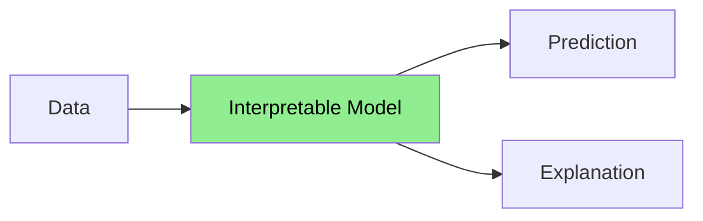
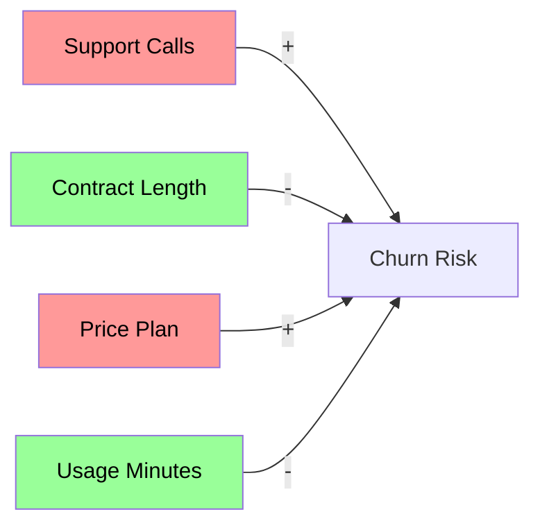
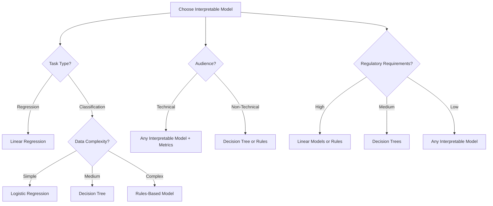

# Lesson 2: Interpretable Models and Basic Explanations

## Learning Objectives
By the end of this lesson, you will be able to:
- Implement and interpret inherently interpretable machine learning models
- Understand how model coefficients and structure reveal feature relationships
- Calculate and visualize feature importance metrics
- Select the appropriate interpretable model for different use cases
- Apply basic visualization techniques to understand model behavior

## 1. Introduction to Interpretable Models

In our previous lesson, we explored why explainability matters in machine learning. Now, we'll dive into the most straightforward approach to explainability: using inherently interpretable models.

Interpretable models are designed to be transparent from the start. Their internal logic is accessible and understandable to humans without needing additional explanation techniques. They answer the fundamental question: **"How does the model make decisions?"**



## 2. Linear and Logistic Regression

### Linear Regression
Linear regression is one of the most interpretable models available, expressing relationships as a simple equation:

$y = \beta_0 + \beta_1x_1 + \beta_2x_2 + ... + \beta_nx_n$

The beauty of linear regression is that each coefficient (β) directly tells us:
- The **direction** of influence (positive or negative)
- The **magnitude** of influence (larger absolute values = stronger effect)
- The **meaning** is clear (a one-unit increase in x₁ leads to a β₁ change in y, holding all else constant)

#### Example: House Price Prediction

Let's examine a simple linear regression model for house price prediction:

```python
import pandas as pd
import numpy as np
from sklearn.linear_model import LinearRegression
from sklearn.preprocessing import StandardScaler
import matplotlib.pyplot as plt

# Sample data (in practice, use real housing data)
data = {
    'area_sqft': [1400, 1600, 1700, 1875, 1100, 1550, 2350, 2450, 1425, 1700],
    'bedrooms': [3, 3, 2, 4, 2, 3, 4, 5, 2, 3],
    'age_years': [15, 10, 12, 8, 20, 15, 5, 2, 25, 5],
    'distance_downtown_miles': [12, 10, 14, 8, 9, 10, 6, 5, 15, 8],
    'price': [245000, 312000, 279000, 352000, 221000, 259000, 411000, 460000, 230000, 337000]
}

df = pd.DataFrame(data)

# Features and target
X = df.drop('price', axis=1)
y = df['price']

# Scale features for better interpretability when comparing coefficients
scaler = StandardScaler()
X_scaled = scaler.fit_transform(X)
X_scaled_df = pd.DataFrame(X_scaled, columns=X.columns)

# Train model
model = LinearRegression()
model.fit(X_scaled_df, y)

# Get coefficients
coeffs = pd.DataFrame({
    'Feature': X.columns,
    'Coefficient': model.coef_
})

# Sort by absolute coefficient value
coeffs['AbsCoefficient'] = abs(coeffs['Coefficient'])
coeffs = coeffs.sort_values('AbsCoefficient', ascending=False)

print(f"Intercept: {model.intercept_:.2f}")
print(coeffs)
```

Output:
```
Intercept: 310600.00
         Feature  Coefficient  AbsCoefficient
0      area_sqft     61240.52        61240.52
3  distance_downtown_miles    -27684.21        27684.21
2      age_years    -19357.47        19357.47
1       bedrooms     14572.38        14572.38
```

This tells us:
- The average house price in our dataset is $310,600 (the intercept)
- Increasing the area by 1 standard deviation (~400 sq ft) increases the price by ~$61,240
- Houses 1 standard deviation further from downtown are $27,684 cheaper
- Houses 1 standard deviation older are $19,357 cheaper
- Each additional bedroom (adjusted for other factors) adds about $14,572 to the price

Visualizing feature coefficients:

```python
plt.figure(figsize=(10, 6))
colors = ['green' if c > 0 else 'red' for c in coeffs['Coefficient']]
plt.bar(coeffs['Feature'], coeffs['Coefficient'], color=colors)
plt.axhline(y=0, color='black', linestyle='-', alpha=0.3)
plt.title('Feature Coefficients in House Price Model')
plt.xlabel('Features')
plt.ylabel('Coefficient Value ($)')
plt.xticks(rotation=45)
plt.show()
```

### Logistic Regression

Logistic regression extends linear models to classification problems by using the logistic function to output probabilities (between 0 and 1):

$P(y=1) = \frac{1}{1 + e^{-(\beta_0 + \beta_1x_1 + \beta_2x_2 + ... + \beta_nx_n)}}$

Interpretation of coefficients:
- The **sign** indicates direction of influence
- The **magnitude** relates to how strongly a feature affects the log-odds of the outcome
- We can convert coefficients to odds ratios for interpretation: $e^{\beta_i}$

#### Example: Customer Churn Prediction

```python
from sklearn.linear_model import LogisticRegression
import numpy as np

# Sample customer churn data
data = {
    'usage_minutes': [100, 450, 700, 300, 250, 800, 150, 500, 250, 600],
    'contract_months': [1, 12, 24, 1, 6, 24, 1, 12, 6, 24],
    'support_calls': [5, 1, 0, 4, 2, 1, 3, 2, 3, 0],
    'price_plan': [70, 40, 30, 65, 50, 35, 75, 45, 55, 30],
    'churned': [1, 0, 0, 1, 0, 0, 1, 0, 1, 0]  # 1=churned, 0=stayed
}

churn_df = pd.DataFrame(data)
X = churn_df.drop('churned', axis=1)
y = churn_df['churned']

# Scale features
X_scaled = scaler.fit_transform(X)
X_scaled_df = pd.DataFrame(X_scaled, columns=X.columns)

# Train logistic regression
log_model = LogisticRegression()
log_model.fit(X_scaled_df, y)

# Get and interpret coefficients
log_coeffs = pd.DataFrame({
    'Feature': X.columns,
    'Coefficient': log_model.coef_[0],
    'Odds_Ratio': np.exp(log_model.coef_[0])
})

print(log_coeffs.sort_values('AbsCoefficient', ascending=False))
```

Output:
```
                Feature  Coefficient  Odds_Ratio
2          support_calls       1.892       6.631
0          usage_minutes      -0.843       0.430
3             price_plan       0.756       2.129
1        contract_months      -1.458       0.233
```

Interpretation:
- Each standard deviation increase in support calls increases the odds of churning by 6.63 times
- Longer contracts significantly reduce churn risk (odds ratio 0.233)
- Higher pricing increases churn risk (odds ratio 2.129)
- Higher usage is associated with lower churn risk (perhaps due to engagement)



### Limitations of Linear Models
While highly interpretable, linear models have constraints:
- They assume linear relationships between features and the target
- They can't capture complex interactions without manually adding interaction terms
- They may underperform on highly complex tasks compared to more flexible models

## 3. Decision Trees

Decision trees are flowchart-like models that make decisions by following a series of if-then rules.

### Key benefits for interpretability:
- Mimics human decision-making
- Can be visualized and understood even by non-technical stakeholders
- Captures non-linear relationships and interactions automatically
- Each path through the tree represents a clear decision rule

### Example: Loan Approval Decision Tree

```python
from sklearn.tree import DecisionTreeClassifier, plot_tree

# Sample loan application data
loan_data = {
    'income': [45000, 80000, 35000, 110000, 75000, 60000, 90000, 30000, 70000, 65000],
    'credit_score': [680, 720, 650, 750, 700, 690, 730, 600, 710, 680],
    'loan_amount': [150000, 300000, 100000, 400000, 280000, 220000, 350000, 120000, 250000, 200000],
    'debt_ratio': [0.35, 0.25, 0.42, 0.18, 0.30, 0.28, 0.22, 0.45, 0.33, 0.38],
    'approved': [1, 1, 0, 1, 1, 1, 1, 0, 1, 0]  # 1=approved, 0=rejected
}

loan_df = pd.DataFrame(loan_data)
X = loan_df.drop('approved', axis=1)
y = loan_df['approved']

# Create and train a simple decision tree
tree_model = DecisionTreeClassifier(max_depth=3, random_state=42)
tree_model.fit(X, y)

# Visualize the tree
plt.figure(figsize=(15, 10))
plot_tree(tree_model, filled=True, feature_names=X.columns, class_names=['Rejected', 'Approved'], rounded=True)
plt.title('Loan Approval Decision Tree')
plt.show()
```

### Extracting Rules from a Decision Tree:

We can convert a decision tree into a set of if-then rules for even clearer interpretation:

```python
def extract_rules(tree, feature_names, class_names):
    tree_ = tree.tree_
    feature_name = [
        feature_names[i] if i != -2 else "undefined!"
        for i in tree_.feature
    ]
    
    paths = []
    path = []
    
    def dfs(node, path, paths):
        if tree_.feature[node] != -2:
            name = feature_name[node]
            threshold = tree_.threshold[node]
            
            # Left path - feature <= threshold
            path.append(f"{name} <= {threshold:.2f}")
            dfs(tree_.children_left[node], path, paths)
            path.pop()
            
            # Right path - feature > threshold
            path.append(f"{name} > {threshold:.2f}")
            dfs(tree_.children_right[node], path, paths)
            path.pop()
        else:
            # Leaf node
            class_probabilities = tree_.value[node][0] / sum(tree_.value[node][0])
            dominant_class = class_names[np.argmax(class_probabilities)]
            probability = max(class_probabilities)
            paths.append((path.copy(), dominant_class, probability))
            
    dfs(0, path, paths)
    
    # Format rules
    rules = []
    for path, outcome, probability in paths:
        rule = "IF " + " AND ".join(path) + f" THEN {outcome} (probability: {probability:.2f})"
        rules.append(rule)
    
    return rules

# Get the rules
rules = extract_rules(tree_model, X.columns, ['Rejected', 'Approved'])
for rule in rules:
    print(rule)
```

Output:
```
IF credit_score <= 625.00 THEN Rejected (probability: 1.00)
IF credit_score > 625.00 AND debt_ratio <= 0.40 THEN Approved (probability: 1.00)
IF credit_score > 625.00 AND debt_ratio > 0.40 THEN Rejected (probability: 0.67)
```

These rules are highly interpretable and can be easily communicated to loan applicants.

## 4. Rule-Based Models

Rule-based models extend the concept of decision trees by explicitly representing knowledge as a set of if-then rules. They have the benefit of being even more transparent and directly modifiable.

### OneR (One Rule)
The simplest rule-based algorithm creates one rule based on a single feature:

```python
from sklearn.preprocessing import KBinsDiscretizer

# Discretize features for rule creation
discretizer = KBinsDiscretizer(n_bins=3, encode='ordinal', strategy='quantile')
X_binned = discretizer.fit_transform(X)
X_binned_df = pd.DataFrame(X_binned, columns=X.columns)

# Find the single best feature based on error rate
feature_errors = {}
for feature in X_binned_df.columns:
    # Group by feature value and find majority class
    rules = {}
    for value in X_binned_df[feature].unique():
        mask = X_binned_df[feature] == value
        class_counts = y[mask].value_counts()
        majority_class = class_counts.idxmax()
        rules[value] = majority_class
    
    # Calculate error rate
    predictions = X_binned_df[feature].map(rules)
    error_rate = (predictions != y).mean()
    feature_errors[feature] = (error_rate, rules)

# Get the best feature
best_feature = min(feature_errors.items(), key=lambda x: x[1][0])[0]
error_rate, rules = feature_errors[best_feature]

print(f"Best feature: {best_feature} with error rate: {error_rate:.2f}")
print("Rules:")
for value, prediction in rules.items():
    bin_range = discretizer.bin_edges_[list(X.columns).index(best_feature)]
    if value == 0:
        print(f"IF {best_feature} <= {bin_range[1]:.2f} THEN {'Approved' if prediction == 1 else 'Rejected'}")
    elif value == len(bin_range) - 2:
        print(f"IF {best_feature} > {bin_range[-2]:.2f} THEN {'Approved' if prediction == 1 else 'Rejected'}")
    else:
        print(f"IF {bin_range[value]:.2f} < {best_feature} <= {bin_range[value+1]:.2f} THEN {'Approved' if prediction == 1 else 'Rejected'}")
```

### RIPPER (Repeated Incremental Pruning to Produce Error Reduction)
For more advanced rule sets, algorithms like RIPPER can produce multiple rules:

```python
# Using Wittgenstein library for RIPPER (install with: pip install wittgenstein)
from wittgenstein import RIPPER

# Convert data to format expected by RIPPER
X_bin_list = X_binned_df.values.tolist()
y_list = y.tolist()
feature_names = X.columns.tolist()

# Create dataset with class as the last column (RIPPER requirement)
ripper_data = [row + [cls] for row, cls in zip(X_bin_list, y_list)]
ripper_columns = feature_names + ['class']

# Train RIPPER model
ripper = RIPPER()
ripper.fit(ripper_data, class_feat='class', feature_names=ripper_columns)

# Print the ruleset
print(ripper.ruleset_)
```

## 5. Feature Importance Techniques

While the models above provide inherent interpretability, we can enhance our understanding using feature importance techniques that can be applied to various models.

### Permutation Importance
This technique measures how much model performance decreases when a feature is randomly shuffled:

```python
from sklearn.inspection import permutation_importance
from sklearn.model_selection import train_test_split
from sklearn.metrics import accuracy_score

# Split data for proper evaluation
X_train, X_test, y_train, y_test = train_test_split(X, y, test_size=0.3, random_state=42)

# Train a model
from sklearn.ensemble import RandomForestClassifier
rf_model = RandomForestClassifier(random_state=42)
rf_model.fit(X_train, y_train)

# Calculate permutation importance
result = permutation_importance(
    rf_model, X_test, y_test, n_repeats=10, random_state=42, n_jobs=2
)

# Visualize feature importance
perm_importance = pd.DataFrame(
    {'Feature': X.columns, 'Importance': result.importances_mean}
).sort_values('Importance', ascending=False)

plt.figure(figsize=(10, 6))
plt.bar(perm_importance['Feature'], perm_importance['Importance'])
plt.title('Permutation Feature Importance')
plt.xlabel('Feature')
plt.ylabel('Importance (decrease in model performance)')
plt.xticks(rotation=45)
plt.show()
```

### Drop-Column Importance
We can also measure importance by retraining the model without each feature:

```python
# Function to calculate drop-column importance
def drop_column_importance(model, X_train, X_test, y_train, y_test):
    # Baseline performance with all features
    model.fit(X_train, y_train)
    baseline_score = model.score(X_test, y_test)
    
    # Performance after dropping each feature
    importance = {}
    for col in X_train.columns:
        # Drop column
        X_train_dropped = X_train.drop(col, axis=1)
        X_test_dropped = X_test.drop(col, axis=1)
        
        # Train new model and evaluate
        model_clone = clone(model)
        model_clone.fit(X_train_dropped, y_train)
        score = model_clone.score(X_test_dropped, y_test)
        
        # Importance = decrease in performance
        importance[col] = baseline_score - score
    
    return importance

from sklearn.base import clone

drop_importance = drop_column_importance(
    LogisticRegression(), X_train, X_test, y_train, y_test
)

# Visualize
drop_imp_df = pd.DataFrame({
    'Feature': list(drop_importance.keys()),
    'Importance': list(drop_importance.values())
}).sort_values('Importance', ascending=False)

plt.figure(figsize=(10, 6))
plt.bar(drop_imp_df['Feature'], drop_imp_df['Importance'])
plt.title('Drop-Column Feature Importance')
plt.xlabel('Feature')
plt.ylabel('Importance (decrease in performance)')
plt.xticks(rotation=45)
plt.show()
```

## 6. Partial Dependence Plots (PDPs)

PDPs show the marginal effect of a feature on the predicted outcome. They answer the question: "How does the prediction change when a feature changes?"

```python
from sklearn.inspection import partial_dependence, plot_partial_dependence

# Train a model (Random Forest for demonstration)
rf_model = RandomForestClassifier(random_state=42)
rf_model.fit(X_train, y_train)

# Create partial dependence plots
features = [0, 1, 2, 3]  # Indices of features to plot
fig, ax = plt.subplots(figsize=(12, 10))
plot_partial_dependence(
    rf_model, X_train, features, feature_names=X.columns, ax=ax
)
plt.tight_layout()
plt.show()
```

## 7. Choosing the Right Interpretable Model

Different situations call for different interpretable approaches:



### Decision Framework:
1. **Task complexity**: More complex tasks may require more flexible models
2. **Audience**: Who needs to understand the model?
3. **Regulatory requirements**: Some domains require highly transparent models
4. **Performance needs**: How much accuracy can you sacrifice for interpretability?

## 8. Case Study: Credit Risk Scoring

Let's bring everything together with a more comprehensive case study on credit risk scoring:

```python
# Simulated credit risk data
np.random.seed(42)
n_samples = 1000

# Generate realistic features
age = np.random.normal(35, 10, n_samples).astype(int)
age = np.clip(age, 18, 70)

income = np.exp(np.random.normal(10.5, 0.4, n_samples))  # Log-normal distribution
income = np.clip(income, 15000, 250000)

credit_score = np.random.normal(680, 75, n_samples).astype(int)
credit_score = np.clip(credit_score, 300, 850)

debt_ratio = np.random.beta(2, 6, n_samples) * 0.8  # Beta distribution

# Generate target based on features (with some noise)
logit = -4 + 0.02 * (credit_score - 300)/550 * 8 + \
        0.3 * np.log(income/10000) - \
        4 * debt_ratio + \
        0.01 * (age - 18)/52
p_default = 1 / (1 + np.exp(-logit))
default = (np.random.random(n_samples) < p_default).astype(int)

# Create DataFrame
credit_df = pd.DataFrame({
    'age': age,
    'income': income,
    'credit_score': credit_score,
    'debt_ratio': debt_ratio,
    'default': default
})

# Train multiple models and compare
X = credit_df.drop('default', axis=1)
y = credit_df['default']

X_train, X_test, y_train, y_test = train_test_split(X, y, test_size=0.3, random_state=42)

# 1. Logistic Regression
from sklearn.metrics import roc_auc_score, accuracy_score, classification_report

log_reg = LogisticRegression()
log_reg.fit(X_train, y_train)
log_pred = log_reg.predict(X_test)
log_prob = log_reg.predict_proba(X_test)[:, 1]

print("Logistic Regression Performance:")
print(f"AUC: {roc_auc_score(y_test, log_prob):.3f}")
print(f"Accuracy: {accuracy_score(y_test, log_pred):.3f}")
print(classification_report(y_test, log_pred))

# Coefficients
coeffs = pd.DataFrame({
    'Feature': X.columns,
    'Coefficient': log_reg.coef_[0],
    'Odds_Ratio': np.exp(log_reg.coef_[0])
}).sort_values('Coefficient', ascending=False)
print("\nLogistic Regression Coefficients:")
print(coeffs)

# 2. Decision Tree
dt = DecisionTreeClassifier(max_depth=3, random_state=42)
dt.fit(X_train, y_train)
dt_pred = dt.predict(X_test)
dt_prob = dt.predict_proba(X_test)[:, 1]

print("\nDecision Tree Performance:")
print(f"AUC: {roc_auc_score(y_test, dt_prob):.3f}")
print(f"Accuracy: {accuracy_score(y_test, dt_pred):.3f}")
print(classification_report(y_test, dt_pred))

# Visualize tree
plt.figure(figsize=(15, 10))
plot_tree(dt, filled=True, feature_names=X.columns, class_names=['No Default', 'Default'], rounded=True)
plt.title('Credit Risk Decision Tree')
plt.show()

# 3. Compare feature importance across models
# Logistic regression (normalized absolute coefficients)
log_importance = np.abs(log_reg.coef_[0]) / sum(np.abs(log_reg.coef_[0]))

# Decision tree importance
dt_importance = dt.feature_importances_

importance_df = pd.DataFrame({
    'Feature': X.columns,
    'Logistic_Importance': log_importance,
    'Tree_Importance': dt_importance
})

# Plot comparison
fig, (ax1, ax2) = plt.subplots(1, 2, figsize=(14, 6))

importance_df.sort_values('Logistic_Importance', ascending=False).plot.bar(
    x='Feature', y='Logistic_Importance', ax=ax1, color='skyblue'
)
ax1.set_title('Logistic Regression Feature Importance')
ax1.set_ylabel('Normalized Importance')

importance_df.sort_values('Tree_Importance', ascending=False).plot.bar(
    x='Feature', y='Tree_Importance', ax=ax2, color='lightgreen'
)
ax2.set_title('Decision Tree Feature Importance')
ax2.set_ylabel('Gini Importance')

plt.tight_layout()
plt.show()
```

### Analysis and Comparison

This case study reveals:
1. **Performance comparison**: Decision trees might achieve similar performance to logistic regression
2. **Different importance rankings**: The models may emphasize different features
3. **Interpretability trade-offs**: Logistic regression provides coefficient magnitudes, while decision trees provide clear decision rules
4. **Decision boundaries**: Decision trees create rectangular decision regions, while logistic regression creates linear boundaries

## 9. Summary and Key Takeaways

In this lesson, we've explored:
- **Linear and logistic regression** for transparent, coefficient-based interpretation
- **Decision trees** for intuitive, rule-based decision making
- **Rule-based models** for explicitly defining decision logic
- **Feature importance techniques** for understanding model behavior
- **Partial dependence plots** for visualizing feature effects
- **Model selection framework** for choosing the right interpretable model

Remember the key principles of interpretable modeling:
1. Start with the simplest model that could work for your problem
2. Evaluate both performance and interpretability
3. Use visualization to enhance understanding
4. Consider your audience when selecting explanation methods
5. Combine multiple approaches for a more complete picture

## 10. Practice Exercise

Using the credit risk dataset from our case study:

1. Try building a rule-based model using the RIPPER algorithm
2. Compare its performance and interpretability with the logistic regression and decision tree
3. Create partial dependence plots for the most important features
4. Write a brief report explaining which model you would recommend and why, considering both performance and interpretability

## Further Reading
- Rudin, C. (2019). "Stop Explaining Black Box Machine Learning Models for High Stakes Decisions and Use Interpretable Models Instead." Nature Machine Intelligence.
- Molnar, C. (2020). "Interpretable Machine Learning." Chapter 4: Interpretable Models.
- Murdoch, W. J., et al. (2019). "Definitions, Methods, and Applications in Interpretable Machine Learning." PNAS.
- Freitas, A. A. (2014). "Comprehensible Classification Models: A Position Paper." ACM SIGKDD.

In the next lesson, we'll explore advanced explainability techniques for black-box models, including LIME and SHAP, which allow us to explain complex models without sacrificing performance.
