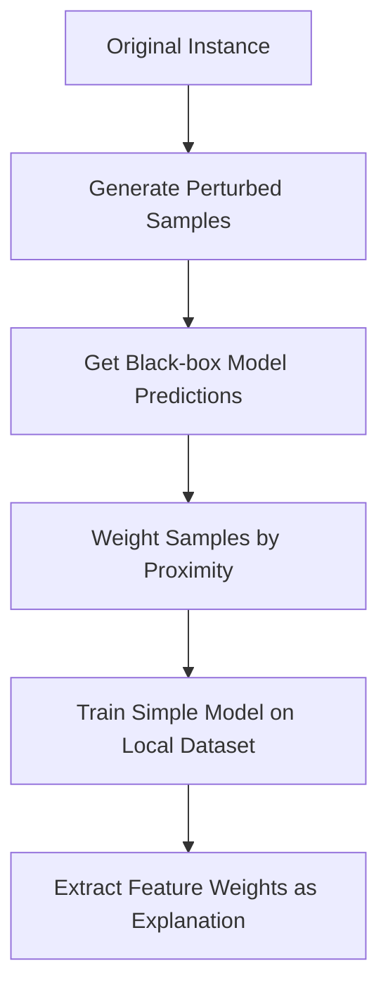
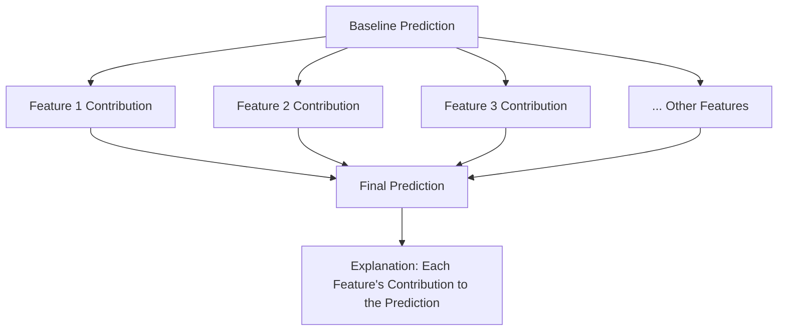
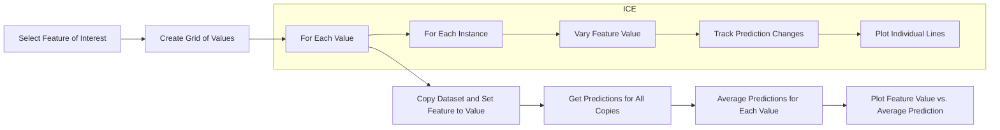
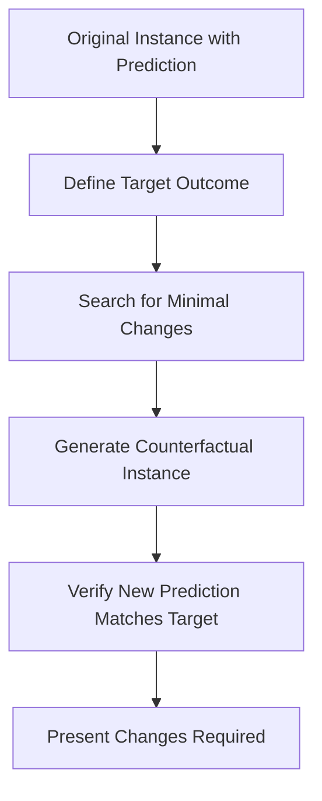

# Lesson 3: Advanced Explainability Techniques

## Learning Objectives

By the end of this lesson, you will be able to:
- Explain and implement LIME to generate local explanations for model predictions
- Calculate and interpret SHAP values for feature attribution
- Create and analyze Partial Dependence Plots (PDPs) and Individual Conditional Expectation (ICE) curves
- Generate and evaluate counterfactual explanations
- Apply advanced explainability techniques to real-world black-box models

## 1. Introduction

While inherently interpretable models provide transparency, many state-of-the-art machine learning models are complex black boxes. Advanced explainability techniques help us peek inside these models and understand their behavior without sacrificing performance. This lesson covers cutting-edge methods that can be applied to any model type.

## 2. LIME (Local Interpretable Model-agnostic Explanations)

### 2.1 Concept Overview

LIME explains individual predictions by approximating the complex model locally with a simpler, interpretable model. It works by:

1. Taking a specific prediction to explain
2. Generating perturbed samples around that instance
3. Getting predictions from the black-box model for these samples
4. Training a simple model (like linear regression) on this local dataset
5. Using the simple model's parameters as the explanation

The key insight is that while the global behavior of a complex model may be difficult to approximate with a simple model, the local behavior around a specific point can often be approximated well.



### 2.2 Python Implementation

```python
import numpy as np
import pandas as pd
from sklearn.ensemble import RandomForestClassifier
from lime import lime_tabular
import matplotlib.pyplot as plt
from sklearn.datasets import load_breast_cancer
from sklearn.model_selection import train_test_split

# Load and prepare the data
data = load_breast_cancer()
X = pd.DataFrame(data.data, columns=data.feature_names)
y = data.target

# Split the data
X_train, X_test, y_train, y_test = train_test_split(X, y, test_size=0.2, random_state=42)

# Train a black-box model
model = RandomForestClassifier(n_estimators=100, random_state=42)
model.fit(X_train, y_train)

# Create a LIME explainer
explainer = lime_tabular.LimeTabularExplainer(
    X_train.values,
    feature_names=X_train.columns,
    class_names=['malignant', 'benign'],
    mode='classification'
)

# Explain a single prediction
instance_idx = 10
exp = explainer.explain_instance(
    X_test.iloc[instance_idx].values, 
    model.predict_proba,
    num_features=6
)

# Visualize the explanation
exp.show_in_notebook()

# Print the explanation
print(f"Actual class: {data.target_names[y_test.iloc[instance_idx]]}")
print(f"Predicted class: {data.target_names[model.predict([X_test.iloc[instance_idx]])[0]]}")
print("Feature importance:")
for feature, weight in exp.as_list():
    print(f"  {feature}: {weight:.4f}")
```

### 2.3 Interpreting LIME Results

- **Positive weights** indicate the feature pushes the prediction toward the target class
- **Negative weights** indicate the feature pushes away from the target class
- **Larger absolute values** indicate stronger influence
- Each explanation is **valid only for the local region** around the explained instance

### 2.4 Advantages and Limitations

**Advantages:**
- Model-agnostic (works with any black-box model)
- Provides intuitive explanations
- Fast computation for individual explanations

**Limitations:**
- Explanations are unstable and may vary with different random samples
- Local fidelity doesn't guarantee global understanding
- Feature interactions might not be captured well
- Parameter selection (neighborhood size) affects results

## 3. SHAP (SHapley Additive exPlanations) Values

### 3.1 Concept Overview

SHAP values provide a unified measure of feature importance based on game theory. They allocate the prediction "credit" fairly among features based on their marginal contributions.

SHAP values have strong theoretical guarantees:
- **Local accuracy**: The sum of SHAP values equals the deviation of the prediction from the baseline
- **Missingness**: Features with no effect get zero SHAP value
- **Consistency**: If a model changes so a feature has a stronger impact, its SHAP value increases



### 3.2 Python Implementation

```python
import shap
import numpy as np
import matplotlib.pyplot as plt
from sklearn.ensemble import RandomForestClassifier
from sklearn.datasets import load_breast_cancer
from sklearn.model_selection import train_test_split

# Load and prepare data
data = load_breast_cancer()
X = pd.DataFrame(data.data, columns=data.feature_names)
y = data.target

# Split the data
X_train, X_test, y_train, y_test = train_test_split(X, y, test_size=0.2, random_state=42)

# Train a model
model = RandomForestClassifier(n_estimators=100, random_state=42)
model.fit(X_train, y_train)

# Create a SHAP explainer
explainer = shap.TreeExplainer(model)

# Calculate SHAP values for test set
shap_values = explainer.shap_values(X_test)

# Visualize SHAP values for a single prediction
instance_idx = 10
plt.figure(figsize=(12, 5))
shap.force_plot(
    explainer.expected_value[1],  # baseline value for "benign" class
    shap_values[1][instance_idx,:],  # SHAP values for "benign" class
    X_test.iloc[instance_idx,:],  # feature values
    feature_names=X_test.columns,
    matplotlib=True
)
plt.tight_layout()
plt.show()

# Summary plot of feature importance
plt.figure(figsize=(10, 8))
shap.summary_plot(shap_values[1], X_test, feature_names=X_test.columns)
plt.tight_layout()
plt.show()

# Dependence plot for most important feature
important_feature = X_test.columns[np.argmax(np.mean(np.abs(shap_values[1]), axis=0))]
plt.figure(figsize=(8, 6))
shap.dependence_plot(important_feature, shap_values[1], X_test, feature_names=X_test.columns)
plt.tight_layout()
plt.show()
```

### 3.3 Interpreting SHAP Results

- **Force plot**: Shows how each feature pushes the model output from the base value
- **Summary plot**: Shows distribution of SHAP values for each feature
- **Dependence plot**: Shows how a feature's SHAP value changes with its actual value

### 3.4 SHAP Implementations

Several versions of SHAP are available for different model types:
- **TreeExplainer**: Fast exact algorithm for tree-based models
- **DeepExplainer**: For deep learning models
- **KernelExplainer**: Model-agnostic but computationally expensive
- **GradientExplainer**: For differentiable models

### 3.5 Advantages and Limitations

**Advantages:**
- Theoretically grounded with unique mathematical properties
- Accounts for feature interactions
- Both local and global interpretability
- Consistent across feature subsets

**Limitations:**
- Computationally expensive (especially KernelExplainer)
- Assumes feature independence in some implementations
- May be complex to explain to non-technical stakeholders

## 4. Partial Dependence Plots (PDP) and ICE Curves

### 4.1 Concept Overview

Partial Dependence Plots show the marginal effect of features on predictions, averaging over all other features. They answer: "How does the prediction change as this feature changes, considering all possible values of other features?"

Individual Conditional Expectation (ICE) curves show how predictions change for individual instances as a feature varies, providing more detailed insight than PDPs.



### 4.2 Python Implementation

```python
from sklearn.ensemble import RandomForestRegressor
from sklearn.datasets import fetch_california_housing
from sklearn.model_selection import train_test_split
from sklearn.inspection import partial_dependence, plot_partial_dependence
import matplotlib.pyplot as plt
import pandas as pd
import numpy as np

# Load and prepare data
housing = fetch_california_housing()
X = pd.DataFrame(housing.data, columns=housing.feature_names)
y = housing.target

# Split the data
X_train, X_test, y_train, y_test = train_test_split(X, y, test_size=0.2, random_state=42)

# Train a model
model = RandomForestRegressor(n_estimators=100, random_state=42)
model.fit(X_train, y_train)

# Create PDP for a single feature
features_to_plot = ['MedInc', 'AveRooms']
fig, ax = plt.subplots(figsize=(10, 6))
plot_partial_dependence(model, X_train, features_to_plot, ax=ax)
plt.tight_layout()
plt.show()

# Create ICE plots with PDP overlay
from pdpbox import pdp

feature = 'MedInc'  # Feature to investigate
pdp_isolate = pdp.pdp_isolate(
    model=model,
    dataset=X_test,
    model_features=X_test.columns,
    feature=feature
)

fig, axes = plt.subplots(1, 2, figsize=(14, 6))
pdp.pdp_plot(pdp_isolate, feature, plot_lines=True, 
             frac_to_plot=0.1, ax=axes[0])  # ICE curves for 10% of instances
axes[0].set_title('ICE Curves with PDP')

pdp.pdp_plot(pdp_isolate, feature, plot_lines=False, ax=axes[1])
axes[1].set_title('PDP Only')
plt.tight_layout()
plt.show()

# Create 2D PDP to show interaction
features_to_plot = ['MedInc', 'AveRooms']
inter1 = pdp.pdp_interact(
    model=model,
    dataset=X_test,
    model_features=X_test.columns,
    features=features_to_plot
)

fig, axes = plt.subplots(1, 2, figsize=(14, 6))
pdp.pdp_interact_plot(
    inter1, features_to_plot,
    plot_type='contour', ax=axes[0]
)
axes[0].set_title('2D Contour PDP')

pdp.pdp_interact_plot(
    inter1, features_to_plot,
    plot_type='grid', ax=axes[1]
)
axes[1].set_title('2D Grid PDP')
plt.tight_layout()
plt.show()
```

### 4.3 Interpreting PDP and ICE Results

- **Monotonic relationship**: The feature has a consistent positive or negative effect
- **Non-monotonic relationship**: The feature's effect changes direction
- **Flat regions**: The feature has no effect in certain ranges
- **Diverging ICE curves**: May indicate feature interactions
- **Clustered ICE curves**: Suggest different model behaviors for different instance subgroups

### 4.4 Advantages and Limitations

**Advantages:**
- Intuitive visualization of feature effects
- Captures non-linear relationships
- ICE curves reveal heterogeneous effects
- Can visualize interactions between features

**Limitations:**
- Assumes feature independence
- Computationally expensive for large datasets
- May create unrealistic data points when features are correlated
- Limited to visualizing 1-2 features at a time

## 5. Counterfactual Explanations

### 5.1 Concept Overview

Counterfactual explanations answer: "What would need to change in this instance to get a different outcome?" They provide actionable insights for specific predictions.



### 5.2 Python Implementation

```python
import numpy as np
import pandas as pd
from sklearn.ensemble import RandomForestClassifier
from sklearn.datasets import load_breast_cancer
from sklearn.model_selection import train_test_split
from alibi.explainers import CounterfactualProto

# Load and prepare data
data = load_breast_cancer()
X = pd.DataFrame(data.data, columns=data.feature_names)
y = data.target

# Split the data
X_train, X_test, y_train, y_test = train_test_split(X, y, test_size=0.2, random_state=42)

# Train a model
model = RandomForestClassifier(n_estimators=100, random_state=42)
model.fit(X_train, y_train)

# Choose an instance to explain
instance_idx = 15
X_explain = X_test.iloc[[instance_idx]].values
original_class = model.predict(X_explain)[0]
target_class = 1 - original_class  # Change to opposite class

# Initialize counterfactual explainer
shape = X_train.shape[1]
cf = CounterfactualProto(
    model.predict,
    shape,
    use_kdtree=True,
    feature_names=X.columns.tolist(),
    class_names=['malignant', 'benign']
)

# Fit the explainer on training data
cf.fit(X_train.values)

# Generate counterfactual explanations
explanation = cf.explain(
    X_explain, 
    threshold=0.9,  # Minimum prediction probability for target class
    target_class=target_class,
    max_iter=1000
)

# Display results
print(f"Original prediction: {data.target_names[original_class]}")
print(f"Counterfactual prediction: {data.target_names[target_class]}")
print("\nChanges needed:")

# Format feature changes in a dataframe for better visualization
orig = pd.DataFrame(X_explain, columns=X.columns)
cf_instance = pd.DataFrame(explanation.cf['X'], columns=X.columns)
change_df = pd.DataFrame({
    'Feature': X.columns,
    'Original Value': orig.values[0],
    'Counterfactual Value': cf_instance.values[0],
    'Difference': cf_instance.values[0] - orig.values[0]
})

# Sort by absolute difference to highlight most important changes
change_df['Abs Difference'] = abs(change_df['Difference'])
change_df = change_df.sort_values('Abs Difference', ascending=False)

# Show only features that changed
changed_features = change_df[change_df['Difference'] != 0]
print(changed_features[['Feature', 'Original Value', 'Counterfactual Value', 'Difference']])
```

### 5.3 Interpreting Counterfactual Results

Counterfactual explanations show:
- The minimal changes needed to alter a prediction
- Which features have the most impact on prediction changes
- Alternative paths to achieve desired outcomes
- The model's decision boundaries around specific instances

### 5.4 Types of Counterfactual Methods

1. **Optimization-based**: Find closest counterfactual by minimizing distance
2. **Generative approaches**: Use GANs or VAEs to generate realistic counterfactuals
3. **Case-based reasoning**: Find similar instances with different outcomes
4. **Rule-based**: Extract rules that explain counterfactual changes

### 5.5 Advantages and Limitations

**Advantages:**
- Provides actionable insights
- Intuitive for non-technical stakeholders
- Doesn't require knowing model internals
- Focuses on decision boundaries most relevant to the instance

**Limitations:**
- May produce unrealistic or impossible counterfactuals
- Computationally intensive
- Multiple valid counterfactuals may exist
- Doesn't provide global understanding of the model

## 6. Hands-on Example: Explaining a Black-box Model Prediction

Let's put these techniques together to comprehensively explain a single prediction from a complex model.

```python
import numpy as np
import pandas as pd
import matplotlib.pyplot as plt
from sklearn.ensemble import GradientBoostingClassifier
from sklearn.model_selection import train_test_split
from sklearn.preprocessing import StandardScaler
import lime.lime_tabular
import shap
from alibi.explainers import CounterfactualProto
from pdpbox import pdp

# Load the heart disease dataset
from sklearn.datasets import fetch_openml
heart = fetch_openml(name='heart-disease', version=1)
X = pd.DataFrame(heart.data)
y = heart.target.astype(int)

# Data preprocessing
X_train, X_test, y_train, y_test = train_test_split(X, y, test_size=0.2, random_state=42)
scaler = StandardScaler()
X_train_scaled = scaler.fit_transform(X_train)
X_test_scaled = scaler.transform(X_test)

# Train a black-box model
model = GradientBoostingClassifier(n_estimators=100, random_state=42)
model.fit(X_train_scaled, y_train)

# Select a single instance to explain
instance_idx = 10
instance = X_test.iloc[instance_idx]
instance_scaled = X_test_scaled[instance_idx].reshape(1, -1)
prediction = model.predict(instance_scaled)[0]
prediction_prob = model.predict_proba(instance_scaled)[0, prediction]

print(f"Instance features:\n{instance}")
print(f"Predicted class: {prediction} with probability: {prediction_prob:.3f}")

# 1. LIME explanation
explainer_lime = lime.lime_tabular.LimeTabularExplainer(
    X_train_scaled,
    feature_names=X.columns,
    class_names=['No Disease', 'Disease'],
    discretize_continuous=True
)

lime_exp = explainer_lime.explain_instance(
    X_test_scaled[instance_idx],
    model.predict_proba,
    num_features=6
)

plt.figure(figsize=(10, 6))
lime_exp.as_pyplot_figure()
plt.title('LIME Explanation')
plt.tight_layout()
plt.show()

# 2. SHAP explanation
explainer_shap = shap.KernelExplainer(model.predict_proba, shap.sample(X_train_scaled, 100))
shap_values = explainer_shap.shap_values(X_test_scaled[instance_idx:instance_idx+1])

plt.figure(figsize=(10, 6))
shap.force_plot(
    explainer_shap.expected_value[prediction],
    shap_values[prediction][0],
    X_test.iloc[instance_idx],
    feature_names=X.columns,
    matplotlib=True
)
plt.title('SHAP Force Plot')
plt.tight_layout()
plt.show()

# 3. Partial Dependence for top features
# Identify top features from LIME
top_feature_idx = np.argmax(np.abs([x[1] for x in lime_exp.as_list()]))
top_feature = X.columns[top_feature_idx]

# Create PDP for top feature
pdp_isolate = pdp.pdp_isolate(
    model=model,
    dataset=X_test_scaled,
    model_features=X.columns,
    feature=top_feature
)

plt.figure(figsize=(8, 6))
pdp.pdp_plot(pdp_isolate, top_feature)
plt.title(f'PDP for {top_feature}')
plt.tight_layout()
plt.show()

# 4. Counterfactual explanation
cf = CounterfactualProto(
    model.predict,
    X_train.shape[1],
    use_kdtree=True,
    feature_names=X.columns.tolist(),
    class_names=['No Disease', 'Disease']
)
cf.fit(X_train_scaled)

cf_explanation = cf.explain(
    instance_scaled,
    threshold=0.7,
    target_class=1 - prediction,
    max_iter=1000
)

if cf_explanation.cf is not None:
    # Transform counterfactual back to original scale
    cf_instance = pd.DataFrame(cf_explanation.cf['X'], columns=X.columns)
    
    # Compare original and counterfactual
    comparison = pd.DataFrame({
        'Feature': X.columns,
        'Original': instance.values,
        'Counterfactual': cf_instance.values[0],
        'Difference': cf_instance.values[0] - instance.values
    })
    
    # Sort by absolute difference
    comparison['Abs Difference'] = abs(comparison['Difference'])
    comparison = comparison.sort_values('Abs Difference', ascending=False)
    
    # Display changes
    print("\nCounterfactual Explanation:")
    print(f"To change prediction from {prediction} to {1-prediction}, make these changes:")
    print(comparison[comparison['Difference'] != 0][['Feature', 'Original', 'Counterfactual', 'Difference']])
else:
    print("No counterfactual found within constraints")

# 5. Explanation summary
print("\nExplanation Summary:")
print("--------------------")
print(f"The model predicted class {prediction} for this instance.")
print("Key factors influencing this prediction:")

# Get top LIME features
lime_features = lime_exp.as_list()
print("\nLIME explains:")
for feature, weight in lime_features[:3]:
    direction = "increases" if weight > 0 else "decreases"
    print(f"- {feature} {direction} probability by {abs(weight):.3f}")

# Summarize SHAP values
shap_summary = pd.DataFrame({
    'Feature': X.columns,
    'SHAP value': shap_values[prediction][0]
})
shap_summary = shap_summary.sort_values('SHAP value', key=abs, ascending=False)

print("\nSHAP explains:")
for i, (feature, value) in enumerate(zip(shap_summary['Feature'], shap_summary['SHAP value'])):
    if i >= 3:
        break
    direction = "increases" if value > 0 else "decreases"
    print(f"- {feature} {direction} probability by {abs(value):.3f}")

# Counterfactual summary
if cf_explanation.cf is not None:
    print("\nTo change the prediction, the most important changes would be:")
    top_changes = comparison[comparison['Difference'] != 0].head(3)
    for _, row in top_changes.iterrows():
        print(f"- Change {row['Feature']} from {row['Original']} to {row['Counterfactual']}")
```

## 7. Exercises

### Exercise 1: LIME vs. SHAP Comparison
Implement both LIME and SHAP on the same black-box model and dataset. Compare the explanations they provide for at least 5 different instances. Note any differences in:
- Top features identified
- Feature importance rankings
- Explanation stability across runs
- Computation time

### Exercise 2: Interactive Counterfactual Explorer
Create a simple tool that:
1. Takes a dataset and pre-trained model
2. Allows selection of a specific instance
3. Generates counterfactual explanations with different constraints
4. Visualizes the changes required for different target outcomes
5. Evaluates the realism of the counterfactuals

### Exercise 3: Custom PDP Function
Implement your own Partial Dependence Plot function from scratch that:
1. Calculates partial dependence values for a chosen feature
2. Creates both PDP and ICE curves
3. Handles categorical features appropriately
4. Allows sampling to improve performance on large datasets
5. Includes confidence intervals

### Exercise 4: Explainability Report
For a given dataset and model:
1. Generate at least 3 different types of explanations
2. Integrate the insights from each method
3. Present a comprehensive explanation tailored for:
   - A technical data scientist
   - A business stakeholder
   - A regulatory compliance officer

## 8. Summary and Key Takeaways

- **LIME** creates simple local approximations of complex models to explain individual predictions
- **SHAP values** provide theoretically fair attribution of prediction outcome to each feature
- **Partial Dependence Plots** show how predictions change as features vary, while **ICE curves** show this relationship for individual instances
- **Counterfactual explanations** identify minimal changes needed to alter predictions
- Different explainability techniques provide complementary insights:
  - LIME and SHAP for feature attribution
  - PDP/ICE for feature effect visualization
  - Counterfactuals for actionable insights
- A comprehensive explanation should combine multiple techniques
- No single technique is perfect—understanding the strengths and limitations of each method is essential

## 9. References and Further Reading

### Papers

1. Ribeiro, M. T., Singh, S., & Guestrin, C. (2016). "Why should I trust you?: Explaining the predictions of any classifier." KDD 2016.
2. Lundberg, S. M., & Lee, S. I. (2017). "A unified approach to interpreting model predictions." NIPS 2017.
3. Friedman, J. H. (2001). "Greedy function approximation: A gradient boosting machine." Annals of Statistics.
4. Wachter, S., Mittelstadt, B., & Russell, C. (2017). "Counterfactual explanations without opening the black box: Automated decisions and the GDPR." Harvard Journal of Law & Technology.
5. Goldstein, A., Kapelner, A., Bleich, J., & Pitkin, E. (2015). "Peeking inside the black box: Visualizing statistical learning with plots of individual conditional expectation." Journal of Computational and Graphical Statistics.

### Books

1. Molnar, C. (2020). "Interpretable Machine Learning." https://christophm.github.io/interpretable-ml-book/
2. Barredo Arrieta, A. et al. (2020). "Explainable Artificial Intelligence (XAI): Concepts, Taxonomies, Opportunities and Challenges toward Responsible AI." Information Fusion.

### Libraries and Tools

1. LIME: https://github.com/marcotcr/lime
2. SHAP: https://github.com/slundberg/shap
3. PDPbox: https://github.com/SauceCat/PDPbox
4. Alibi: https://github.com/SeldonIO/alibi
5. ELI5: https://github.com/TeamHG-Memex/eli5
6. InterpretML: https://github.com/interpretml/interpret

### Online Resources

1. Distill.pub - "Feature Visualization": https://distill.pub/2017/feature-visualization/
2. Google's "People + AI Guidebook": https://pair.withgoogle.com/
3. FastML's "Interpretable Machine Learning" series
4. Towards Data Science - "Explaining Black-Box Models"
