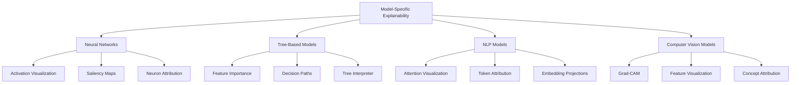

# Lesson 4: Explainability for Different ML Models

## Learning Objectives

By the end of this lesson, you will be able to:
- Apply appropriate explainability techniques for different model architectures
- Interpret neural network decisions using activation maps and saliency methods
- Extract decision paths and feature contributions from tree-based models
- Visualize and understand attention mechanisms in NLP models
- Use Grad-CAM and similar techniques to explain computer vision models
- Select the most appropriate explainability technique based on model type and use case

## 1. Introduction

While model-agnostic techniques (LIME, SHAP, counterfactuals) can explain any ML model, model-specific approaches leverage the unique architecture of different models to provide deeper insights. This lesson explores specialized explainability methods tailored to specific model types, providing more precise understanding of how different architectures make decisions.



## 2. Neural Network Explainability

Neural networks are notoriously difficult to interpret due to their complex, layered structure. However, several techniques leverage the network's architecture to provide insights into its decision-making process.

### 2.1 Activation Maps and Layer Visualization

Neural networks build hierarchical representations, with earlier layers detecting simple features and deeper layers combining them into complex concepts. By visualizing the activations at different layers, we can see what patterns the network recognizes.

```python
import tensorflow as tf
from tensorflow.keras.applications import VGG16
from tensorflow.keras.applications.vgg16 import preprocess_input
from tensorflow.keras.preprocessing import image
import numpy as np
import matplotlib.pyplot as plt
import matplotlib.cm as cm

# Load pre-trained model
model = VGG16(weights='imagenet', include_top=True)
model.summary()

# Load and preprocess image
img_path = 'elephant.jpg'
img = image.load_img(img_path, target_size=(224, 224))
x = image.img_to_array(img)
x = np.expand_dims(x, axis=0)
x = preprocess_input(x)

# Function to visualize activations of a specific layer
def visualize_activations(model, layer_name, input_image):
    # Create a model that outputs the layer activations
    layer_outputs = [layer.output for layer in model.layers if layer.name == layer_name]
    activation_model = tf.keras.models.Model(inputs=model.input, outputs=layer_outputs)
    
    # Get activations
    activations = activation_model.predict(input_image)
    
    # Visualize the first 64 channels (or fewer if there are less)
    plt.figure(figsize=(15, 8))
    
    features = activations[0]
    channels = min(64, features.shape[-1])
    
    for i in range(channels):
        plt.subplot(8, 8, i+1)
        plt.imshow(features[0, :, :, i], cmap='viridis')
        plt.axis('off')
    
    plt.suptitle(f'Activations in layer: {layer_name}')
    plt.tight_layout()
    plt.show()

# Visualize activations for different layers
visualize_activations(model, 'block1_conv2', x)  # Early layer
visualize_activations(model, 'block3_conv3', x)  # Middle layer
visualize_activations(model, 'block5_conv3', x)  # Late layer
```

### 2.2 Saliency Maps and Class Activation Maps

Saliency maps highlight which parts of the input contributed most to the network's decision. These methods use backpropagation to determine which input regions were most influential.

```python
import tensorflow as tf
from tensorflow.keras.applications import VGG16
from tensorflow.keras.applications.vgg16 import preprocess_input, decode_predictions
from tensorflow.keras.preprocessing import image
import numpy as np
import matplotlib.pyplot as plt
import cv2

# Load pre-trained model
model = VGG16(weights='imagenet')

# Load and preprocess image
img_path = 'elephant.jpg'
img = image.load_img(img_path, target_size=(224, 224))
img_array = image.img_to_array(img)
x = np.expand_dims(img_array, axis=0)
x = preprocess_input(x)

# Get model prediction
preds = model.predict(x)
class_idx = np.argmax(preds[0])
class_name = decode_predictions(preds, top=1)[0][0][1]
print(f"Predicted class: {class_name}")

# Function to create vanilla saliency map
def vanilla_saliency(model, input_image, class_idx):
    # Create a tensor for the input image
    input_tensor = tf.convert_to_tensor(input_image)
    
    with tf.GradientTape() as tape:
        tape.watch(input_tensor)
        # Get prediction
        predictions = model(input_tensor)
        target_class = predictions[:, class_idx]
    
    # Get gradients
    gradients = tape.gradient(target_class, input_tensor)
    
    # Take maximum across color channels
    saliency = tf.reduce_max(tf.abs(gradients), axis=-1)
    return saliency.numpy()[0]

# Generate and display saliency map
saliency_map = vanilla_saliency(model, x, class_idx)

plt.figure(figsize=(10, 5))

plt.subplot(1, 2, 1)
plt.imshow(img)
plt.title('Original Image')
plt.axis('off')

plt.subplot(1, 2, 2)
plt.imshow(saliency_map, cmap='hot')
plt.title('Saliency Map')
plt.axis('off')

plt.tight_layout()
plt.show()

# Grad-CAM implementation
def grad_cam(model, input_image, class_idx, layer_name='block5_conv3'):
    # Gradient model that outputs both the prediction and the activations of the specified layer
    grad_model = tf.keras.models.Model(
        inputs=[model.inputs],
        outputs=[model.get_layer(layer_name).output, model.output]
    )
    
    with tf.GradientTape() as tape:
        # Get both the activations of the last conv layer and predictions
        conv_outputs, predictions = grad_model(input_image)
        target_class = predictions[:, class_idx]
    
    # Gradients of the target class with respect to the output feature map
    grads = tape.gradient(target_class, conv_outputs)
    
    # Global average pooling: weights of each feature map
    pooled_grads = tf.reduce_mean(grads, axis=(0, 1, 2))
    
    # Multiply each channel by its importance
    weighted_conv_outputs = conv_outputs * pooled_grads
    
    # Sum all channels
    cam = tf.reduce_sum(weighted_conv_outputs, axis=-1)
    cam = cam.numpy()[0]
    
    # Normalize the CAM
    cam = np.maximum(cam, 0)  # ReLU
    cam = (cam - cam.min()) / (cam.max() - cam.min() + 1e-10)  # Normalize
    
    # Resize to match input size
    cam = cv2.resize(cam, (224, 224))
    
    return cam

# Generate and display Grad-CAM
cam = grad_cam(model, x, class_idx)

plt.figure(figsize=(15, 5))

plt.subplot(1, 3, 1)
plt.imshow(img)
plt.title('Original Image')
plt.axis('off')

plt.subplot(1, 3, 2)
plt.imshow(cam, cmap='jet')
plt.title('Grad-CAM')
plt.axis('off')

plt.subplot(1, 3, 3)
# Overlay CAM on original image
heatmap = cv2.applyColorMap(np.uint8(255 * cam), cv2.COLORMAP_JET)
heatmap = cv2.cvtColor(heatmap, cv2.COLOR_BGR2RGB)
overlay = heatmap * 0.4 + img_array * 0.6
plt.imshow(overlay / 255)
plt.title('Grad-CAM Overlay')
plt.axis('off')

plt.tight_layout()
plt.show()
```

### 2.3 Integrated Gradients and DeepLIFT

Advanced techniques like Integrated Gradients and DeepLIFT (Deep Learning Important FeaTures) attribute predictions to input features through more sophisticated methods than vanilla gradients.

```python
import tensorflow as tf
import numpy as np
import matplotlib.pyplot as plt
from tensorflow.keras.applications import VGG16
from tensorflow.keras.applications.vgg16 import preprocess_input
from tensorflow.keras.preprocessing import image

# Load model and image (as in previous examples)
model = VGG16(weights='imagenet')
img_path = 'elephant.jpg'
img = image.load_img(img_path, target_size=(224, 224))
img_array = image.img_to_array(img)
x = np.expand_dims(img_array, axis=0)
x = preprocess_input(x)

# Get prediction
preds = model.predict(x)
class_idx = np.argmax(preds[0])

# Integrated Gradients implementation
def integrated_gradients(model, input_image, class_idx, baseline=None, steps=50):
    # If no baseline is provided, use zeros
    if baseline is None:
        baseline = np.zeros_like(input_image)
    
    # Generate alphas for interpolation
    alphas = np.linspace(0, 1, steps)
    gradient_sum = np.zeros_like(input_image).astype(np.float32)
    
    for alpha in alphas:
        # Interpolate between baseline and input
        interpolated = baseline + alpha * (input_image - baseline)
        
        # Get gradients
        with tf.GradientTape() as tape:
            interpolated_tensor = tf.convert_to_tensor(interpolated, dtype=tf.float32)
            tape.watch(interpolated_tensor)
            predictions = model(interpolated_tensor)
            target_class = predictions[:, class_idx]
        
        gradients = tape.gradient(target_class, interpolated_tensor)
        gradient_sum += gradients.numpy()
    
    # Average and multiply by the input-baseline difference
    integrated_grads = gradient_sum * (input_image - baseline) / steps
    
    return integrated_grads[0]

# Calculate integrated gradients
ig_attributions = integrated_gradients(model, x, class_idx)

# Visualize the attributions
def visualize_attributions(attributions, original_image):
    # Get magnitude of attributions across color channels
    attribution_magnitude = np.max(np.abs(attributions), axis=-1)
    
    plt.figure(figsize=(10, 5))
    
    plt.subplot(1, 2, 1)
    plt.imshow(original_image / 255)  # Convert back to 0-1 range
    plt.title('Original Image')
    plt.axis('off')
    
    plt.subplot(1, 2, 2)
    plt.imshow(attribution_magnitude, cmap='hot')
    plt.title('Integrated Gradients')
    plt.axis('off')
    
    plt.tight_layout()
    plt.show()

visualize_attributions(ig_attributions, img_array)
```

### 2.4 Interpreting Neural Network Explanations

When analyzing neural network explanations:

1. **Activation maps** show what patterns each neuron detects
2. **Saliency maps** highlight input regions that influenced the prediction
3. **Grad-CAM** focuses on class-specific feature regions
4. **Integrated Gradients** provides feature-level attribution with theoretical guarantees

The key is to match the explanation to your question:
- "What part of the image is the model focusing on?" → Use Grad-CAM
- "Which pixels contributed most to the classification?" → Use Integrated Gradients
- "What features is each layer detecting?" → Use activation visualization

## 3. Tree-based Model Explanations

Tree-based models (Decision Trees, Random Forests, Gradient Boosting) offer more inherent interpretability than neural networks. Their hierarchical decision structure can be directly examined.

### 3.1 Feature Importance from Trees

Tree-based models provide built-in feature importance metrics based on how frequently features are used in splits and how much they improve the objective function.

```python
import pandas as pd
import numpy as np
import matplotlib.pyplot as plt
from sklearn.ensemble import RandomForestClassifier
from sklearn.datasets import load_breast_cancer
from sklearn.model_selection import train_test_split

# Load data
data = load_breast_cancer()
X = pd.DataFrame(data.data, columns=data.feature_names)
y = data.target

# Split data
X_train, X_test, y_train, y_test = train_test_split(X, y, test_size=0.2, random_state=42)

# Train Random Forest
rf = RandomForestClassifier(n_estimators=100, random_state=42)
rf.fit(X_train, y_train)

# Get feature importances
importances = rf.feature_importances_
std = np.std([tree.feature_importances_ for tree in rf.estimators_], axis=0)
indices = np.argsort(importances)[::-1]

# Plot feature importances
plt.figure(figsize=(12, 8))
plt.title("Feature Importances")
plt.bar(range(X.shape[1]), importances[indices], yerr=std[indices], align="center")
plt.xticks(range(X.shape[1]), [X.columns[i] for i in indices], rotation=90)
plt.xlim([-1, X.shape[1]])
plt.tight_layout()
plt.show()

# Calculate permutation importance for more robust estimates
from sklearn.inspection import permutation_importance

result = permutation_importance(rf, X_test, y_test, n_repeats=10, random_state=42)
perm_importances = result.importances_mean
perm_std = result.importances_std
perm_indices = np.argsort(perm_importances)[::-1]

# Plot permutation importances
plt.figure(figsize=(12, 8))
plt.title("Permutation Feature Importances")
plt.bar(range(X.shape[1]), perm_importances[perm_indices], yerr=perm_std[perm_indices], align="center")
plt.xticks(range(X.shape[1]), [X.columns[i] for i in perm_indices], rotation=90)
plt.xlim([-1, X.shape[1]])
plt.tight_layout()
plt.show()
```

### 3.2 Decision Paths and Tree Visualization

For individual trees, we can visualize the entire decision process. For ensembles, we can trace the path of a specific instance through the trees.

```python
import pandas as pd
import numpy as np
import matplotlib.pyplot as plt
from sklearn.tree import DecisionTreeClassifier, plot_tree, export_text
from sklearn.datasets import load_breast_cancer

# Load data
data = load_breast_cancer()
X = pd.DataFrame(data.data, columns=data.feature_names)
y = data.target

# Train a single decision tree for visualization
dt = DecisionTreeClassifier(max_depth=3, random_state=42)
dt.fit(X, y)

# Visualize the tree
plt.figure(figsize=(20, 10))
plot_tree(dt, feature_names=X.columns, class_names=['malignant', 'benign'], 
          filled=True, rounded=True, fontsize=10)
plt.title("Decision Tree Visualization")
plt.tight_layout()
plt.show()

# Print text representation of the tree
tree_text = export_text(dt, feature_names=list(X.columns))
print("Tree as Text:")
print(tree_text)

# For Random Forest, visualize the decision path of a specific instance
from sklearn.ensemble import RandomForestClassifier

rf = RandomForestClassifier(n_estimators=5, max_depth=3, random_state=42)
rf.fit(X, y)

# Select an instance to explain
instance = X.iloc[0:1]
print(f"Instance features:\n{instance.T}")

# Get decision paths for the instance in each tree
for i, tree in enumerate(rf.estimators_):
    node_indicator = tree.decision_path(instance)
    leaf_id = tree.apply(instance)
    
    # Get all nodes the instance passes through
    node_index = node_indicator.indices[node_indicator.indptr[0]:node_indicator.indptr[1]]
    
    print(f"\nTree {i} decision path:")
    
    # Print decision path
    for node in node_index:
        if node == leaf_id[0]:
            # Node is a leaf node
            print(f"    Leaf node {node}: prediction = {tree.predict(instance)[0]}")
        else:
            # Decision node
            feature = tree.tree_.feature[node]
            threshold = tree.tree_.threshold[node]
            
            if instance.iloc[0, feature] <= threshold:
                direction = "<="
            else:
                direction = ">"
                
            print(f"    Node {node}: {X.columns[feature]} {direction} {threshold:.2f}")
```

### 3.3 TreeInterpreter and Path Importance

TreeInterpreter breaks down a prediction into bias (initial value) and feature contributions, showing how each feature shifted the prediction along the decision path.

```python
import pandas as pd
import numpy as np
import matplotlib.pyplot as plt
from sklearn.ensemble import RandomForestRegressor
from sklearn.datasets import load_diabetes
from sklearn.model_selection import train_test_split

# Load regression dataset
data = load_diabetes()
X = pd.DataFrame(data.data, columns=data.feature_names)
y = data.target

# Split data
X_train, X_test, y_train, y_test = train_test_split(X, y, test_size=0.2, random_state=42)

# Train Random Forest regressor
rf = RandomForestRegressor(n_estimators=100, random_state=42)
rf.fit(X_train, y_train)

# Create TreeInterpreter function (since it's not standard in sklearn)
def tree_interpreter(model, instance):
    """Calculate feature contributions for a random forest model"""
    # Initialize with bias (mean of training data)
    bias = model.predict(np.zeros((1, instance.shape[1])))[0]
    
    # Initialize contributions array
    contributions = np.zeros(instance.shape[1])
    
    # Calculate contributions from each tree
    for tree in model.estimators_:
        path = tree.decision_path(instance.reshape(1, -1))
        
        # Get all nodes in the path
        path_indices = path.indices[path.indptr[0]:path.indptr[1]]
        
        # For each node except the leaf, calculate contribution
        for i in range(len(path_indices) - 1):
            node = path_indices[i]
            child = path_indices[i + 1]
            
            # Get feature used for split
            feature = tree.tree_.feature[node]
            
            # Get left and right child values
            left_value = tree.tree_.value[tree.tree_.children_left[node]][0][0]
            right_value = tree.tree_.value[tree.tree_.children_right[node]][0][0]
            
            # Contribution is the change in prediction value
            if child == tree.tree_.children_left[node]:
                contributions[feature] += (left_value - tree.tree_.value[node][0][0]) / model.n_estimators
            else:
                contributions[feature] += (right_value - tree.tree_.value[node][0][0]) / model.n_estimators
    
    return bias, contributions

# Choose an instance to explain
instance_idx = 0
instance = X_test.iloc[instance_idx].values
actual_value = y_test.iloc[instance_idx]
prediction = rf.predict([instance])[0]

# Get feature contributions
bias, contributions = tree_interpreter(rf, instance)

# Display contributions
feature_names = X.columns
feature_contributions = pd.DataFrame({
    'Feature': feature_names,
    'Contribution': contributions
})

# Sort by absolute contribution
feature_contributions['Abs_Contribution'] = abs(feature_contributions['Contribution'])
feature_contributions = feature_contributions.sort_values('Abs_Contribution', ascending=False)

print(f"Actual value: {actual_value}")
print(f"Predicted value: {prediction}")
print(f"Bias (average prediction): {bias}")
print(f"Sum of contributions: {sum(contributions)}")
print(f"Prediction = Bias + Sum of Contributions: {bias + sum(contributions)}")

# Visualize contributions as a waterfall chart
plt.figure(figsize=(12, 6))
plt.barh(range(len(feature_contributions)), feature_contributions['Contribution'])
plt.yticks(range(len(feature_contributions)), feature_contributions['Feature'])
plt.xlabel('Contribution to Prediction')
plt.title('Feature Contributions')
plt.grid(True, alpha=0.3)
plt.tight_layout()
plt.show()
```

### 3.4 Interpreting Tree-based Model Explanations

When analyzing tree-based model explanations:

1. **Feature importance** shows global importance but may be biased toward high-cardinality features
2. **Permutation importance** provides a more robust measure but is computationally expensive
3. **Decision paths** show exactly how a prediction was made through a sequence of if-then rules
4. **Feature contributions** quantify how each feature pushed the prediction up or down

Tree-based explanations are particularly valuable because they:
- Match the model's actual decision process
- Show both global importance and local decisions
- Are computationally efficient
- Capture non-linear effects and interactions

## 4. NLP Model Interpretability

Modern NLP models use complex architectures like transformers with attention mechanisms. Special techniques can help us understand how these models process and interpret text.

### 4.1 Attention Visualization

Attention mechanisms in NLP models show which words the model focuses on when making predictions. Visualizing these attention weights reveals relationships between words.

```python
import torch
from transformers import BertTokenizer, BertModel
import matplotlib.pyplot as plt
import numpy as np
import seaborn as sns

# Load pre-trained model and tokenizer
tokenizer = BertTokenizer.from_pretrained('bert-base-uncased')
model = BertModel.from_pretrained('bert-base-uncased', output_attentions=True)

# Input text
text = "The quick brown fox jumps over the lazy dog."

# Tokenize input
inputs = tokenizer(text, return_tensors="pt")
tokens = tokenizer.convert_ids_to_tokens(inputs["input_ids"][0])

# Get model output with attention weights
with torch.no_grad():
    outputs = model(**inputs)

# Get attention weights
attention = outputs.attentions  # Shape: [layers, batch, heads, seq_len, seq_len]

# Function to visualize attention
def plot_attention(attention_layer, attention_head, tokens):
    attention_matrix = attention[attention_layer][0, attention_head].numpy()
    
    plt.figure(figsize=(10, 8))
    sns.heatmap(attention_matrix, xticklabels=tokens, yticklabels=tokens, cmap="YlGnBu")
    plt.title(f"Layer {attention_layer+1}, Head {attention_head+1} Attention")
    plt.tight_layout()
    plt.show()

# Visualize attention for a specific layer and head
layer_to_visualize = 11  # Last layer
head_to_visualize = 0    # First head
plot_attention(layer_to_visualize, head_to_visualize, tokens)

# Visualize attention across all heads in a layer
def plot_attention_heads(layer, tokens):
    plt.figure(figsize=(15, 8))
    
    attention_layer = attention[layer][0].numpy()  # Shape: [heads, seq_len, seq_len]
    num_heads = attention_layer.shape[0]
    
    # Calculate grid dimensions
    grid_size = int(np.ceil(np.sqrt(num_heads)))
    
    for head in range(num_heads):
        plt.subplot(grid_size, grid_size, head+1)
        sns.heatmap(attention_layer[head], xticklabels=tokens if head >= (num_heads-grid_size) else [], 
                   yticklabels=tokens if head % grid_size == 0 else [], cmap="YlGnBu", cbar=False)
        plt.title(f"Head {head+1}")
    
    plt.suptitle(f"Layer {layer+1} Attention Heads")
    plt.tight_layout()
    plt.show()

# Visualize all attention heads in the last layer
plot_attention_heads(layer_to_visualize, tokens)
```

### 4.2 Token Attribution Methods

These methods reveal which tokens in the input were most important for a specific prediction.

```python
import torch
from transformers import AutoModelForSequenceClassification, AutoTokenizer
import numpy as np
import matplotlib.pyplot as plt

# Load pre-trained model for sentiment analysis
model_name = "textattack/distilbert-base-uncased-SST-2"
tokenizer = AutoTokenizer.from_pretrained(model_name)
model = AutoModelForSequenceClassification.from_pretrained(model_name)

# Input text
text = "This movie was fantastic! The plot was engaging and the acting was superb."

# Tokenize input
inputs = tokenizer(text, return_tensors="pt")
tokens = tokenizer.convert_ids_to_tokens(inputs["input_ids"][0])

# Function for integrated gradients
def integrated_gradients(model, inputs, target_class, steps=50):
    # Create baseline (all [PAD] tokens)
    baseline_ids = torch.ones_like(inputs['input_ids']) * tokenizer.pad_token_id
    baseline = {'input_ids': baseline_ids, 'attention_mask': torch.zeros_like(inputs['attention_mask'])}
    
    # Enable gradient calculation
    for param in model.parameters():
        param.requires_grad = False
    
    # Get gradients
    attribution = torch.zeros_like(inputs['input_ids']).float()
    
    for alpha in np.linspace(0, 1, steps):
        # Interpolate between baseline and input
        interp_ids = baseline['input_ids'] + alpha * (inputs['input_ids'] - baseline['input_ids'])
        interp_mask = baseline['attention_mask'] + alpha * (inputs['attention_mask'] - baseline['attention_mask'])
        
        # Create tensor with gradient tracking
        interp_ids_tensor = interp_ids.float()
        interp_ids_tensor.requires_grad = True
        
        # Forward pass
        outputs = model(input_ids=interp_ids.long(), attention_mask=interp_mask)
        
        # Get gradients with respect to inputs
        if target_class is None:
            # Use predicted class
            target = outputs.logits.argmax(dim=1)
        else:
            target = torch.tensor([target_class])
            
        score = outputs.logits[:, target]
        
        # Backward pass
        score.backward()
        
        # Add to attribution
        attribution += interp_ids_tensor.grad / steps
    
    # Element-wise multiply with (input - baseline)
    attribution *= (inputs['input_ids'] - baseline['input_ids']).float()
    
    return attribution.detach().numpy()[0]

# Calculate attributions
attributions = integrated_gradients(model, inputs, target_class=1)  # 1 = positive sentiment

# Visualize token attributions
def plot_token_attributions(tokens, attributions):
    # Remove special tokens
    token_text = []
    token_attrs = []
    
    for i, token in enumerate(tokens):
        if token not in ['[CLS]', '[SEP]', '[PAD]']:
            token_text.append(token)
            token_attrs.append(attributions[i])
    
    # Normalize for visualization
    max_attr = max(abs(min(token_attrs)), abs(max(token_attrs)))
    norm_attrs = [attr / max_attr for attr in token_attrs]
    
    # Plot
    plt.figure(figsize=(12, 4))
    
    # Create colormap: red for negative, green for positive
    colors = ['red' if a < 0 else 'green' for a in norm_attrs]
    alphas = [abs(a) for a in norm_attrs]
    
    plt.bar(range(len(token_text)), alphas, color=colors)
    plt.xticks(range(len(token_text)), token_text, rotation=45)
    plt.xlabel("Tokens")
    plt.ylabel("Attribution Score")
    plt.title("Token Attribution for Sentiment Prediction")
    plt.tight_layout()
    plt.show()

# Plot token attributions
plot_token_attributions(tokens, attributions)
```

### 4.3 Word Embedding Analysis

Word embeddings capture semantic relationships between words. We can visualize them to understand the model's language representation.

```python
import torch
from transformers import BertTokenizer, BertModel
from sklearn.decomposition import PCA
import matplotlib.pyplot as plt
import numpy as np

# Load pre-trained model and tokenizer
tokenizer = BertTokenizer.from_pretrained('bert-base-uncased')
model = BertModel.from_pretrained('bert-base-uncased')

# Define words to visualize
words = [
    "king", "queen", "man", "woman", "prince", "princess",
    "actor", "actress", "waiter", "waitress",
    "dog", "cat", "horse", "cow", "sheep",
    "happy", "sad", "angry", "joyful", "depressed"
]

# Get embeddings for each word
embeddings = []
labels = []

for word in words:
    # Tokenize
    inputs = tokenizer(word, return_tensors="pt")
    
    # Get embedding from the model
    with torch.no_grad():
        outputs = model(**inputs)
    
    # Take embedding of the word token (avoid special tokens)
    word_id = inputs.input_ids[0][1]
    word_embedding = model.embeddings.word_embeddings(word_id).numpy()
    
    embeddings.append(word_embedding)
    labels.append(word)

# Convert to numpy array
embeddings = np.array(embeddings)

# Reduce dimensions for visualization using PCA
pca = PCA(n_components=2)
reduced_embeddings = pca.fit_transform(embeddings)

# Plot embeddings
plt.figure(figsize=(12, 8))
plt.scatter(reduced_embeddings[:, 0], reduced_embeddings[:, 1], c='blue', alpha=0.7)

# Add labels for each point
for i, word in enumerate(labels):
    plt.annotate(word, (reduced_embeddings[i, 0], reduced_embeddings[i, 1]), fontsize=12)

plt.title("Word Embeddings PCA Visualization")
plt.grid(True, alpha=0.3)
plt
