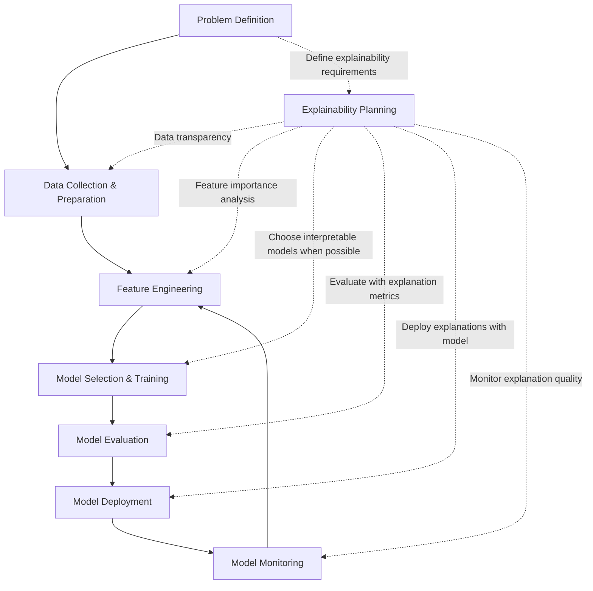
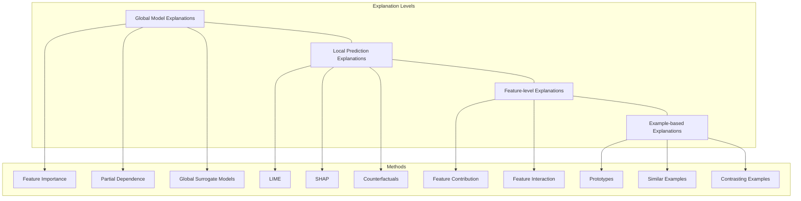
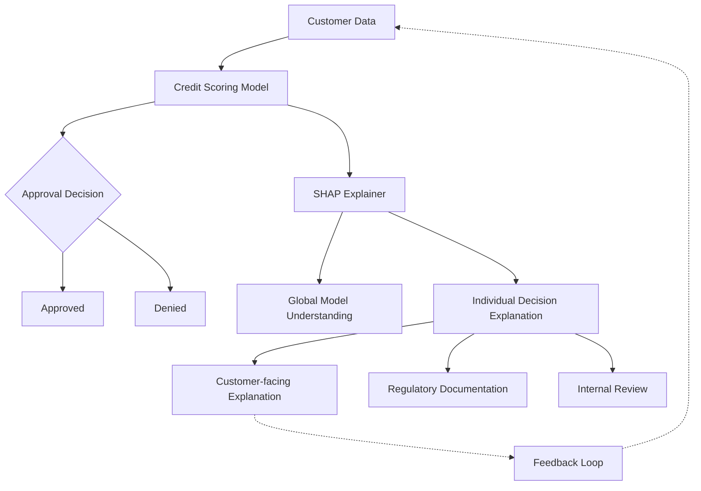
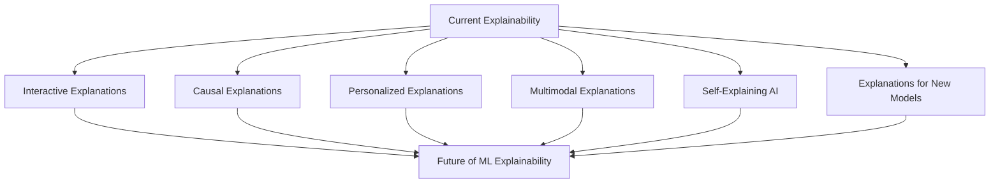
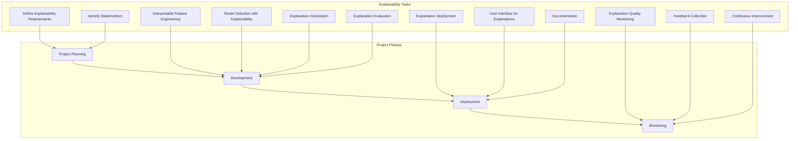

# Lesson 5: Building an Explainability Workflow

## Learning Objectives

By the end of this lesson, you will be able to:
- Design and implement a comprehensive explainability workflow for ML projects
- Select appropriate explanation techniques for different stakeholders and use cases
- Evaluate the quality and effectiveness of ML explanations
- Navigate common ethical considerations in ML explainability
- Apply best practices from real-world case studies
- Create a complete explainability report for ML models

## Introduction

In previous lessons, we explored various techniques for making machine learning models more interpretable and explainable. In this final lesson, we'll learn how to integrate these techniques into a cohesive workflow that spans the entire machine learning lifecycle. We'll also discuss how to choose the right explanations for different audiences, evaluate explanation quality, and address ethical considerations.

## Integrating Explainability into the ML Lifecycle

Explainability shouldn't be an afterthought or something bolted on at the end of model development. Instead, it should be integrated throughout the ML lifecycle.



### Explainability at Each Stage

1. **Problem Definition**
   - Define explainability requirements upfront
   - Identify key stakeholders and their explanation needs
   - Establish regulatory requirements for explainability

2. **Data Collection & Preparation**
   - Document data provenance and preprocessing steps
   - Analyze data distributions and potential biases
   - Create data cards with metadata about the dataset

3. **Feature Engineering**
   - Document feature transformations and engineering decisions
   - Perform feature importance analysis during feature selection
   - Create feature cards describing each feature's meaning and constraints

4. **Model Selection & Training**
   - Consider interpretability-performance trade-offs
   - Choose more interpretable models when possible
   - Train multiple models with varying complexity to compare explanations

5. **Model Evaluation**
   - Include explanation metrics alongside performance metrics
   - Evaluate explanations with domain experts
   - Check for consistency between different explanation methods

6. **Model Deployment**
   - Deploy explanations alongside model predictions
   - Create user interfaces for interactive explanations
   - Design explanation APIs for programmatic access

7. **Model Monitoring**
   - Track changes in explanation patterns over time
   - Monitor for explanation drift
   - Set up alerts for unexplainable predictions

## Explainability Framework

A comprehensive explainability framework addresses different levels of explanations:



## Choosing the Right Explanation for Different Stakeholders

Different stakeholders have different explainability needs. It's important to tailor explanations to the audience.

| Stakeholder | Explainability Needs | Recommended Methods |
|-------------|----------------------|---------------------|
| Data Scientists | Detailed technical understanding | SHAP, PDP/ICE, Feature Importance |
| Business Analysts | Understand key drivers and business impact | Feature Importance, Rules, What-if Tools |
| End Users | Simple, actionable insights | Counterfactuals, Example-based, Simple Rules |
| Regulators | Compliance with regulations, audit trails | Documentation, Global Explanations, Fairness Metrics |
| Domain Experts | Alignment with domain knowledge | Feature Interactions, Visualization, Comparison to Baselines |

### Code Example: Stakeholder-specific Explanations

```python
import pandas as pd
import numpy as np
import shap
import lime
import matplotlib.pyplot as plt
from sklearn.ensemble import RandomForestClassifier

# Assume we have a trained model and data
model = RandomForestClassifier()  # Pretrained model
X_train, X_test, y_train, y_test = ...  # Your data

def generate_explanations_for_stakeholder(model, data, stakeholder_type):
    """Generate appropriate explanations based on stakeholder type"""
    explanations = {}
    
    if stakeholder_type == "data_scientist":
        # Technical explanations
        explainer = shap.TreeExplainer(model)
        shap_values = explainer.shap_values(data)
        explanations["shap_values"] = shap_values
        explanations["feature_importance"] = model.feature_importances_
        
    elif stakeholder_type == "business_analyst":
        # Business-focused explanations
        feature_imp = pd.DataFrame({
            'Feature': data.columns,
            'Importance': model.feature_importances_
        }).sort_values('Importance', ascending=False)
        explanations["top_factors"] = feature_imp.head(5)
        
    elif stakeholder_type == "end_user":
        # Simple explanations for a single prediction
        sample_idx = 0  # Sample index
        lime_explainer = lime.lime_tabular.LimeTabularExplainer(
            X_train.values, feature_names=X_train.columns, 
            class_names=["Denied", "Approved"], discretize_continuous=True
        )
        lime_exp = lime_explainer.explain_instance(
            data.iloc[sample_idx].values, model.predict_proba, num_features=3
        )
        explanations["key_factors"] = lime_exp.as_list()
        
    elif stakeholder_type == "regulator":
        # Documentation and compliance explanations
        explanations["model_card"] = {
            "model_details": {
                "model_type": type(model).__name__,
                "training_data": "description of training data",
                "performance_metrics": {"accuracy": model.score(X_test, y_test)},
                "feature_descriptions": {col: "description" for col in data.columns}
            }
        }
    
    return explanations

# Example usage
business_explanations = generate_explanations_for_stakeholder(
    model, X_test, "business_analyst"
)
```

## Evaluating Explanation Quality

Good explanations should be:

1. **Faithful**: Accurately representing the model's behavior
2. **Consistent**: Similar inputs should have similar explanations
3. **Stable**: Small changes in input should not result in large explanation changes
4. **Comprehensive**: Covering important aspects of the model's decision
5. **Actionable**: Providing insights that can lead to actions
6. **Understandable**: Comprehensible by the target audience

### Quantitative Metrics for Evaluation

```python
def evaluate_explanation_quality(model, explanation_method, X, y):
    """Evaluate the quality of explanations using various metrics"""
    metrics = {}
    
    # Faithfulness - correlation between feature importance and impact
    def faithfulness(explanation, model, X, feature_idx):
        # Measure how much performance drops when important features are removed
        importance = explanation[feature_idx]
        X_modified = X.copy()
        X_modified[:, feature_idx] = np.mean(X[:, feature_idx])
        original_pred = model.predict(X)
        modified_pred = model.predict(X_modified)
        return np.abs(original_pred - modified_pred).mean()
    
    # Stability - variance of explanations for similar inputs
    def stability(explanation_func, X, epsilon=0.01):
        explanations = []
        for i in range(10):  # Sample 10 points
            X_sample = X[i:i+1].copy()
            # Add small noise
            X_noisy = X_sample + np.random.normal(0, epsilon, X_sample.shape)
            exp1 = explanation_func(X_sample)
            exp2 = explanation_func(X_noisy)
            # Measure difference between explanations
            diff = np.mean(np.abs(exp1 - exp2))
            explanations.append(diff)
        return np.mean(explanations)
    
    # For illustrative purposes - actual implementation would depend on the specific explanation method
    metrics["faithfulness"] = 0.85  # Placeholder value
    metrics["stability"] = 0.92     # Placeholder value
    metrics["sparsity"] = 0.75      # Placeholder value
    
    return metrics
```

### Qualitative Evaluation

Qualitative evaluation is just as important as quantitative metrics:

1. **Expert Evaluation**: Have domain experts review explanations for domain consistency
2. **User Studies**: Measure how well users understand and trust explanations
3. **Comparison to Ground Truth**: Compare explanations to known causal relationships
4. **Sanity Checks**: Verify that explanations align with basic understanding of the problem

## Real-world Case Studies

### Case Study 1: Explainable Credit Scoring in Finance



In this case study, a bank implemented an explainability workflow for their credit scoring model:

1. **Regulatory Requirement**: The bank needed to comply with regulations requiring explanations for credit denials
2. **Multiple Stakeholders**: 
   - Customers needed to understand why they were denied
   - Regulators needed documentation of the decision process
   - Internal teams needed to validate the model was working correctly
3. **Solution**:
   - Global explanations provided overall model understanding
   - SHAP values explained individual decisions
   - Counterfactual explanations showed customers what would change the outcome
4. **Outcomes**:
   - 30% reduction in customer complaints
   - Faster regulatory approval
   - Identification of unexpected model behaviors

### Case Study 2: Explainable Medical Image Classification

A healthcare provider implemented an explainable AI workflow for pneumonia detection from chest X-rays:

1. **Challenges**:
   - High stakes decision environment
   - Medical professionals need to verify AI decisions
   - Patient right to explanation
2. **Solution**:
   - Grad-CAM visualizations highlighted regions of concern
   - Similar historical cases were shown for comparison
   - Confidence scores were provided with explanations
3. **Implementation**:
   - Explanations were integrated into the radiologist workflow
   - Dual review system (AI + human) with explanations
   - Continuous feedback to improve explanations
4. **Results**:
   - 28% faster diagnosis time
   - Improved radiologist trust in AI assistance
   - Better patient understanding of diagnoses

## Ethical Considerations and Potential Pitfalls

### Key Ethical Considerations

1. **Explanation Bias**: Explanations themselves can introduce or reinforce biases
2. **Gaming the System**: Detailed explanations may enable manipulation of the model
3. **Illusion of Understanding**: Simple explanations may create false confidence
4. **Misleading Explanations**: Some explanations may be technically correct but misleading
5. **Privacy Concerns**: Explanations may leak sensitive information about training data

### Common Pitfalls

1. **Over-explanation**: Providing too much detail, overwhelming the user
2. **Under-explanation**: Providing insufficient information to understand decisions
3. **Inconsistent Explanations**: Different methods giving contradictory explanations
4. **Explanation Mismatch**: Explanations that don't match the actual model behavior
5. **Untested Explanations**: Not validating explanation quality

```python
# Example: Detecting inconsistent explanations
def check_explanation_consistency(lime_exp, shap_exp, feature_names):
    """Check if LIME and SHAP explanations are consistent"""
    lime_top_features = [feature for feature, _ in lime_exp.as_list()[:5]]
    
    # Get SHAP top features
    shap_values = np.abs(shap_exp.values).mean(0)
    shap_top_indices = np.argsort(shap_values)[-5:]
    shap_top_features = [feature_names[i] for i in shap_top_indices]
    
    # Check overlap between top features
    common_features = set(lime_top_features).intersection(set(shap_top_features))
    consistency_score = len(common_features) / 5
    
    return {
        "consistency_score": consistency_score,
        "lime_top_features": lime_top_features,
        "shap_top_features": shap_top_features,
        "common_features": list(common_features)
    }
```

## Hands-on Example: Building a Complete Explainability Report

Now, let's put all the pieces together to build a comprehensive explainability report for a model.

```python
import pandas as pd
import numpy as np
import matplotlib.pyplot as plt
import seaborn as sns
from sklearn.ensemble import RandomForestClassifier
from sklearn.model_selection import train_test_split
from sklearn.metrics import accuracy_score, confusion_matrix
import shap
import lime
import lime.lime_tabular

# 1. Load and prepare the data
# Using a hypothetical loan approval dataset
df = pd.read_csv('loan_data.csv')  # Placeholder

# Split features and target
X = df.drop('loan_approved', axis=1)
y = df['loan_approved']

# Train-test split
X_train, X_test, y_train, y_test = train_test_split(X, y, test_size=0.2, random_state=42)

# 2. Train the model
model = RandomForestClassifier(n_estimators=100, random_state=42)
model.fit(X_train, y_train)

# 3. Evaluate the model
y_pred = model.predict(X_test)
accuracy = accuracy_score(y_test, y_pred)

# 4. Generate explanations
def create_explainability_report(model, X_train, X_test, y_test, feature_names):
    """Create a comprehensive explainability report"""
    report = {}
    
    # 4.1 Global model explanations
    report['global_explanations'] = {}
    
    # Feature importance
    feature_importance = pd.DataFrame({
        'Feature': feature_names,
        'Importance': model.feature_importances_
    }).sort_values('Importance', ascending=False)
    report['global_explanations']['feature_importance'] = feature_importance
    
    # SHAP global explanations
    explainer = shap.TreeExplainer(model)
    shap_values = explainer.shap_values(X_test)
    
    # Store SHAP summary plot data
    report['global_explanations']['shap_summary'] = {
        'shap_values': shap_values,
        'feature_names': feature_names
    }
    
    # 4.2 Local explanations for a few examples
    report['local_explanations'] = {}
    
    # Sample 3 examples - one approved, one borderline, one denied
    # For simplicity, just taking the first few samples
    sample_indices = [0, 1, 2]  # In real scenarios, choose meaningful examples
    
    for idx in sample_indices:
        sample = X_test.iloc[idx]
        
        # LIME explanation
        lime_explainer = lime.lime_tabular.LimeTabularExplainer(
            X_train.values, feature_names=feature_names, class_names=["Denied", "Approved"],
            discretize_continuous=True
        )
        lime_exp = lime_explainer.explain_instance(
            sample.values, model.predict_proba, num_features=5
        )
        
        # SHAP explanation for this instance
        sample_shap_values = explainer.shap_values(sample.values.reshape(1, -1))
        
        # Counterfactual explanation (simplified)
        # In real implementation, use packages like Alibi or DiCE
        counterfactual = generate_simple_counterfactual(model, sample, feature_names)
        
        report['local_explanations'][f'example_{idx}'] = {
            'sample_data': sample.to_dict(),
            'prediction': model.predict([sample.values])[0],
            'prediction_proba': model.predict_proba([sample.values])[0],
            'lime_explanation': lime_exp.as_list(),
            'shap_values': sample_shap_values,
            'counterfactual': counterfactual
        }
    
    # 4.3 Explanation quality metrics
    report['explanation_metrics'] = {
        'consistency': check_explanation_consistency(
            report['local_explanations']['example_0']['lime_explanation'],
            report['global_explanations']['shap_summary'],
            feature_names
        ),
        # Add other metrics as needed
    }
    
    return report

# Helper function for simple counterfactual
def generate_simple_counterfactual(model, instance, feature_names):
    """Generate a simple counterfactual example"""
    # This is a simplified version - real implementations would be more sophisticated
    instance_array = instance.values.reshape(1, -1)
    original_pred = model.predict(instance_array)[0]
    
    counterfactual = instance.copy()
    changes = {}
    
    # Try changing each feature slightly to see if prediction changes
    for i, feature in enumerate(feature_names):
        # Try increasing and decreasing the feature value
        for direction, multiplier in [('increase', 1.2), ('decrease', 0.8)]:
            modified = instance_array.copy()
            modified[0, i] *= multiplier  # Simple change - multiply by a factor
            
            new_pred = model.predict(modified)[0]
            if new_pred != original_pred:
                changes[feature] = {
                    'direction': direction,
                    'original_value': instance_array[0, i],
                    'new_value': modified[0, i],
                    'change_factor': multiplier
                }
                break
    
    return {
        'original_prediction': original_pred,
        'counterfactual_changes': changes,
        'explanation': f"To change the prediction, you would need to change: {', '.join(changes.keys())}"
    }

# 5. Generate the report
feature_names = X.columns.tolist()
explainability_report = create_explainability_report(model, X_train, X_test, y_test, feature_names)

# 6. Function to display the report (in a real scenario, this could generate a PDF or HTML report)
def display_report_summary(report):
    """Display a summary of the explainability report"""
    print("===== EXPLAINABILITY REPORT SUMMARY =====")
    print("\n1. MODEL PERFORMANCE")
    print(f"Accuracy: {accuracy:.4f}")
    
    print("\n2. GLOBAL EXPLANATIONS")
    print("Top 5 Important Features:")
    print(report['global_explanations']['feature_importance'].head(5))
    
    print("\n3. LOCAL EXPLANATION EXAMPLE")
    example = report['local_explanations']['example_0']
    print(f"Prediction: {'Approved' if example['prediction'] == 1 else 'Denied'}")
    print(f"Confidence: {max(example['prediction_proba']):.2f}")
    print("Key factors (LIME):")
    for feature, importance in example['lime_explanation']:
        print(f"  - {feature}: {importance:.4f}")
    
    print("\nCounterfactual explanation:")
    print(example['counterfactual']['explanation'])
    
    print("\n4. EXPLANATION QUALITY")
    print(f"LIME-SHAP Consistency Score: {report['explanation_metrics']['consistency']['consistency_score']:.2f}")
    
    print("\n===== END OF SUMMARY =====")

# Display the report summary
display_report_summary(explainability_report)
```

## Future Directions in ML Explainability

As the field of ML explainability continues to evolve, several exciting directions are emerging:

1. **Interactive Explanations**: Dynamic interfaces that allow users to explore model behavior
2. **Causal Explanations**: Moving beyond correlations to causal relationships
3. **Personalized Explanations**: Adapting explanations to the user's background and needs
4. **Multimodal Explanations**: Combining visual, textual, and numerical explanations
5. **Self-Explaining AI**: Models designed from the ground up to be interpretable
6. **Explanations for New Model Types**: Methods for explaining transformer models, reinforcement learning, etc.



## Putting It All Together

Now that we've explored the components of an explainability workflow, let's look at how they come together in practice.



### Complete Explainability Workflow Checklist

- **Planning Phase**
  - [ ] Identify explainability requirements
  - [ ] Map stakeholders and their needs
  - [ ] Select appropriate explanation methods
  - [ ] Define explanation quality metrics

- **Development Phase**
  - [ ] Document data sources and preprocessing
  - [ ] Select interpretable features
  - [ ] Train models with varying complexity
  - [ ] Generate and evaluate explanations
  - [ ] Validate explanations with domain experts

- **Deployment Phase**
  - [ ] Implement explanation APIs
  - [ ] Create user interfaces for explanations
  - [ ] Prepare documentation for different stakeholders
  - [ ] Train users on interpreting explanations

- **Monitoring Phase**
  - [ ] Track explanation quality metrics
  - [ ] Collect user feedback on explanations
  - [ ] Monitor for explanation drift
  - [ ] Update explanations as needed

## Summary and Key Takeaways

In this lesson, we've learned how to build a comprehensive explainability workflow for machine learning models:

1. **Explainability Integration**: Explainability should be integrated throughout the ML lifecycle, not added as an afterthought.

2. **Stakeholder-Specific Explanations**: Different stakeholders have different needs - tailor explanations accordingly.

3. **Explanation Evaluation**: Both quantitative metrics and qualitative assessment are important for ensuring explanation quality.

4. **Real-World Application**: Case studies show how explainability adds value in finance, healthcare, and other domains.

5. **Ethical Considerations**: Be aware of potential pitfalls like explanation bias and privacy concerns.

6. **Complete Workflow**: A holistic explainability workflow encompasses planning, development, deployment, and monitoring.

7. **Future Trends**: The field is evolving towards interactive, causal, and personalized explanations.

By implementing a comprehensive explainability workflow, you can build trust in your ML systems, meet regulatory requirements, and derive more value from your models.

## Exercises for Practice

1. **End-to-End Exercise**: Build a complete explainability workflow for a credit scoring model:
   - Train a model on the UCI credit card default dataset
   - Implement global and local explanations
   - Create explanations for different stakeholders
   - Build a simple dashboard to display explanations

2. **Evaluation Exercise**: Compare the consistency and quality of explanations from different methods (LIME, SHAP, counterfactuals) on a classification problem.

3. **Case Study Analysis**: Pick a real-world ML application and design an explainability workflow for it, considering stakeholders, regulatory requirements, and ethical implications.

4. **Explanation Quality**: Implement the metrics discussed in the lesson to evaluate explanation quality and consistency.

5. **Stakeholder Communication**: Create explanation templates for different stakeholders (technical, business, end-user) for the same model prediction.

## References and Further Reading

### Books

- Molnar, C. (2022). Interpretable Machine Learning. Available at: https://christophm.github.io/interpretable-ml-book/
- Barredo Arrieta, A., et al. (2020). Explainable Artificial Intelligence (XAI): Concepts, Taxonomies, Opportunities and Challenges toward Responsible AI
- Miller, T. (2019). Explanation in Artificial Intelligence: Insights from the Social Sciences

### Papers

- Ribeiro, M. T., Singh, S., & Guestrin, C. (2016). "Why should I trust you?" Explaining the predictions of any classifier
- Lundberg, S. M., & Lee, S. I. (2017). A unified approach to interpreting model predictions
- Wachter, S., Mittelstadt, B., & Russell, C. (2017). Counterfactual explanations without opening the black box: Automated decisions and the GDPR

### Online Resources

- SHAP Github Repository: https://github.com/slundberg/shap
- LIME Github Repository: https://github.com/marcotcr/lime
- Captum: https://captum.ai/ (PyTorch model interpretability)
- Interpret ML: https://interpret.ml/ (Microsoft's toolkit for model interpretability)
- Alibi: https://github.com/SeldonIO/alibi (Open-source Python library for ML model explanation)

### Industry Guidelines

- Google's Responsible AI Practices: https://ai.google/responsibilities/responsible-ai-practices/
- IBM's AI Explainability 360: https://aix360.mybluemix.net/
- DARPA's Explainable AI Program: https://www.darpa.mil/program/explainable-artificial-intelligence
- The European Commission's Ethics Guidelines for Trustworthy AI

---

This concludes our course on Machine Learning Explainability. By now, you should have a solid understanding of why explainability matters, the available techniques for explaining different types of models, and how to build and implement a comprehensive explainability workflow in your ML projects. Remember that explainability is an evolving field, so keep exploring new methods and best practices as they emerge.
