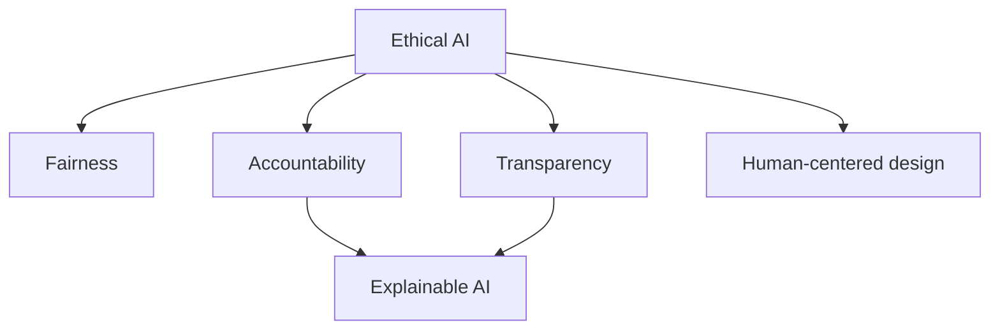
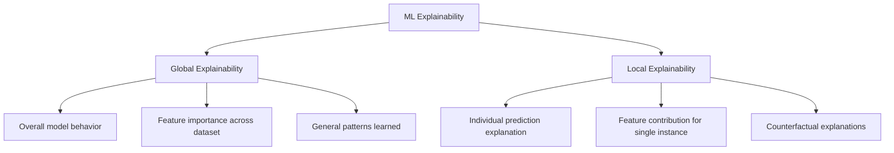
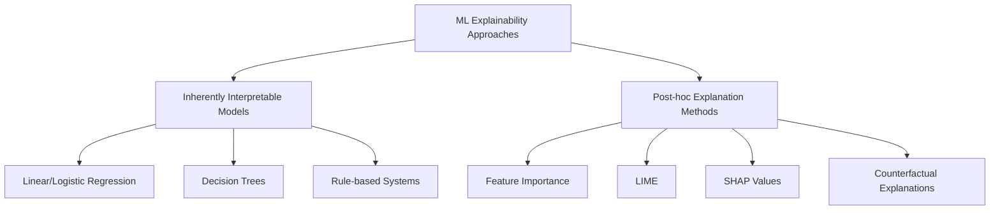
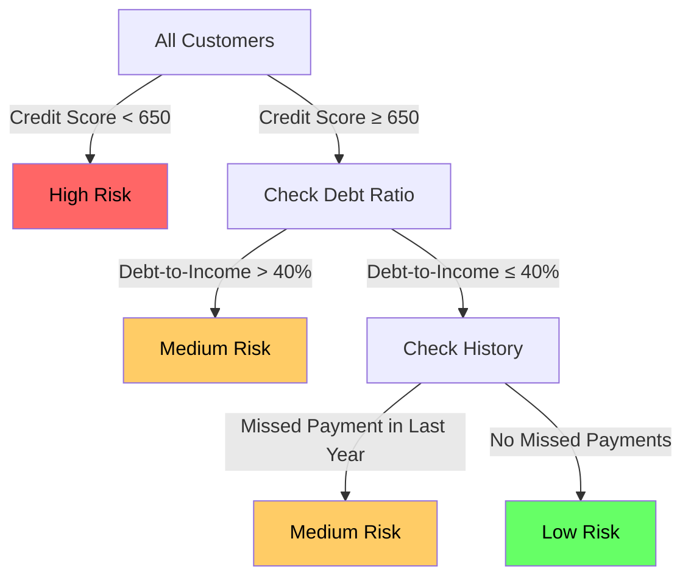

# Lesson 1: Introduction to Machine Learning Explainability

## Learning Objectives
By the end of this lesson, you will be able to:
- Explain why explainability in machine learning is important
- Distinguish between interpretable and black-box models
- Understand the regulatory and ethical reasons for model explainability
- Differentiate between global and local explainability
- Recognize the trade-off between model performance and interpretability

## 1. Why Explainability Matters

Machine learning models are increasingly making decisions that affect our daily lives - from loan approvals to medical diagnoses, from content recommendations to hiring decisions. As these systems become more powerful and widespread, an important question arises: **Can we understand and trust how these models make decisions?**

Consider this scenario:

> Imagine you're a data scientist who built a model to predict which patients are at high risk for diabetes. The model has 95% accuracy on test data, which is excellent. However, when doctors start using your model, they want to know *why* the model flagged certain patients as high-risk. Without this explanation, they're reluctant to incorporate the model's predictions into their treatment plans.

This scenario highlights a fundamental challenge in machine learning: **high performance isn't always enough**. In many contexts, we also need to understand how and why the model reaches its conclusions.

## 2. The Black Box Problem

Many modern machine learning models, especially deep learning models, operate as "black boxes" - they take inputs and produce outputs, but their internal reasoning process remains opaque.


This lack of transparency creates several issues:

- **Trust gap**: Users may not trust predictions they don't understand
- **Debugging difficulty**: When models fail, it's hard to identify why
- **Bias detection**: Harmful biases may go unnoticed inside a black box
- **Knowledge discovery**: Valuable insights within the model remain hidden

## 3. Regulatory and Ethical Considerations

The need for explainable AI isn't just practical—it's increasingly becoming a legal requirement.

### Regulatory Frameworks

Several regulations now explicitly or implicitly require model explainability:

- **GDPR (EU)**: Includes a "right to explanation" for algorithmic decisions
- **Fair Credit Reporting Act (US)**: Requires explanation for adverse credit decisions
- **FDA regulations**: Medical AI systems often need to explain their reasoning

### Ethical Imperatives

Beyond regulations, ethical AI principles emphasize explainability:



## 4. Types of Explainability

When discussing explainability, we typically differentiate between two key types:

### Global Explainability
Understanding how the model works overall and which features generally influence its predictions.

**Example**: In a loan approval model, knowing that income, credit history, and debt-to-income ratio are the top three factors that influence decisions across all applications.

### Local Explainability
Understanding why the model made a specific prediction for an individual instance.

**Example**: Explaining why John's loan application was rejected by identifying that his high debt-to-income ratio was the primary factor in this specific case.



## 5. The Interpretability-Performance Trade-off

One of the central challenges in machine learning explainability is the frequent trade-off between model performance and interpretability.


Color represents interpretability: 
- 🟢 Green: Highly interpretable
- 🔴 Red: Low interpretability

In general:
- **Simpler models** (linear regression, small decision trees) are more interpretable but may have lower performance on complex tasks
- **Complex models** (deep neural networks, large ensembles) often achieve higher performance but are harder to interpret

### Example: Diagnosing Pneumonia

Imagine building a model to diagnose pneumonia from chest X-rays:

1. A logistic regression model achieves 73% accuracy and is fully interpretable
2. A deep neural network achieves 95% accuracy but functions as a black box

Which would you choose? The answer depends on your specific needs:
- In a research setting exploring disease factors, you might prefer the interpretable model
- In a triage system supporting radiologists, you might prefer the high-performance model with additional explainability techniques

## 6. Approaches to ML Explainability

Let's look at the main approaches to making ML models more explainable:



### Inherently Interpretable Models
These models are designed to be interpretable from the beginning. Their structure and parameters have clear meanings.

### Post-hoc Explanation Methods
These techniques are applied after a model is trained to help explain its behavior, even for black-box models.

## 7. Real-World Example: Credit Approval

Let's consider a practical example of model explainability in action:

**Scenario**: A bank uses machine learning to decide whether to approve credit card applications.

**Without explainability**:
- Customer receives rejection: "Your application was denied based on our algorithmic assessment."
- Customer feels frustrated, has no idea how to improve their situation
- Bank might face regulatory scrutiny for unexplainable decisions
- Model might contain undetected biases against certain demographic groups

**With explainability**:
- Customer receives rejection with explanation: "Your application was denied primarily due to your high debt-to-income ratio (65%) and recent late payment on your auto loan."
- Customer understands what factors to address to improve chances next time
- Bank can verify the model isn't using inappropriate factors for decisions
- Compliance team can confirm the model follows fair lending practices

## 8. Practical Exercise

Let's work through a simple example to illustrate global explainability using a basic decision tree.

Imagine we have a model that predicts whether a bank customer will default on a loan based on various features. Here's a simplified decision tree:



This tree provides global explainability by showing:
1. Credit score is the most important feature (it's at the top)
2. There are clear thresholds for decision-making (650 for credit score, 40% for debt ratio)
3. The logic flow is visible and can be followed by non-technical stakeholders

**Python Code Example:**
```python
from sklearn.tree import DecisionTreeClassifier
from sklearn import tree
import matplotlib.pyplot as plt

# Train a simple decision tree (in practice, you'd use real data)
# X_train would be features like credit_score, debt_ratio, etc.
# y_train would be labels (0: no default, 1: default)
model = DecisionTreeClassifier(max_depth=3)
model.fit(X_train, y_train)

# Visualize the tree
plt.figure(figsize=(12,8))
tree.plot_tree(model, filled=True, feature_names=['credit_score', 'debt_ratio', 'missed_payments', 'loan_amount'], 
               class_names=['no_default', 'default'])
plt.show()

# Get feature importances
importances = model.feature_importances_
features = ['credit_score', 'debt_ratio', 'missed_payments', 'loan_amount']

for feature, importance in zip(features, importances):
    print(f"{feature}: {importance:.4f}")
```

## 9. Summary and Key Takeaways

In this lesson, we've explored:

- **Why explainability matters**: For trust, debugging, regulatory compliance, and knowledge discovery
- **The black box problem**: Many powerful models lack transparency in their decision-making
- **Types of explainability**: Global (model-wide) and local (instance-specific)
- **The interpretability-performance trade-off**: Simpler models are more interpretable but may perform worse
- **Approaches to explainability**: Inherently interpretable models and post-hoc explanation methods
- **Real-world application**: How explainability enhances credit decision systems

## 10. Next Steps

In the next lesson, we'll dive deeper into interpretable models and basic explanation techniques, learning how to implement and use these methods in practice.

## Further Reading
- Molnar, C. (2020). Interpretable Machine Learning. A Guide for Making Black Box Models Explainable.
- Rudin, C. (2019). Stop Explaining Black Box Machine Learning Models for High Stakes Decisions and Use Interpretable Models Instead. Nature Machine Intelligence.
- Gilpin, L. H., et al. (2018). Explaining Explanations: An Overview of Interpretability of Machine Learning.

---

## Exercise for Practice

1. Consider a machine learning application you're familiar with or interested in (e.g., recommendation systems, medical diagnosis, fraud detection).
2. Identify:
   - Why explainability would be important in this context
   - What types of stakeholders would benefit from explanations
   - What specific challenges to explainability might exist
   - Whether global or local explanations (or both) would be most valuable

Share your thoughts in the discussion section!
